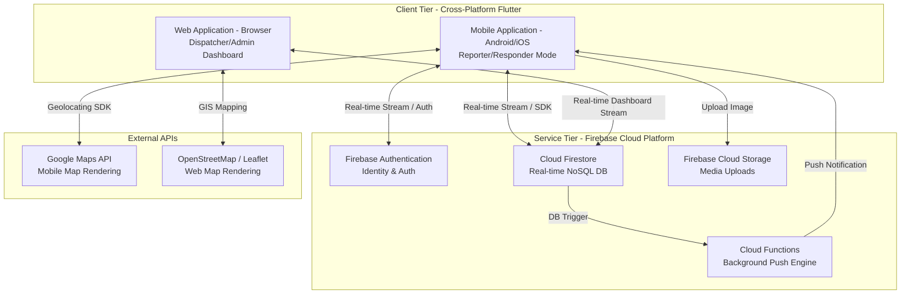
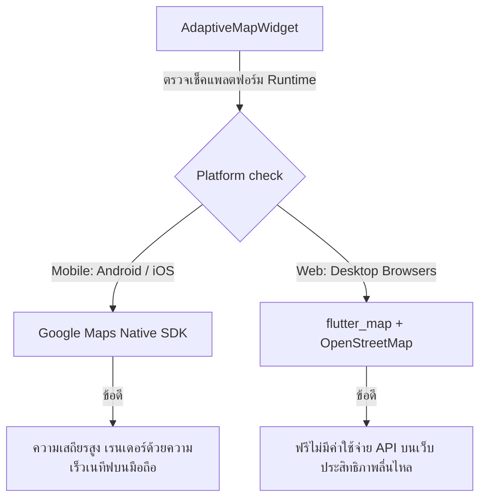

# SUT Campus Incident System - System Architecture Document

ระบบแจ้งเหตุภายในมหาวิทยาลัยเทคโนโลยีสุรนารี (SUT Campus Incident System) ได้รับการออกแบบสถาปัตยกรรมซอฟต์แวร์โดยใช้รูปแบบ **Feature-First Clean Architecture** ร่วมกับการจัดการสถานะด้วย **Riverpod (State Management)** เพื่อแยกแยะหน้าที่ความรับผิดชอบของโค้ด (Separation of Concerns) ทำให้ระบบมีความยืดหยุ่นสูง สามารถทดสอบได้ง่าย (Testability) และรองรับการขยายตัวในอนาคต (Scalability)

---

## 1. ภาพรวมสถาปัตยกรรมระดับสูง (High-Level Architecture Overview)

ระบบทำงานบนสถาปัตยกรรมแบบ **3-Tier Distributed Architecture** ที่เชื่อมโยงระหว่างอุปกรณ์พกพา เว็บไซต์ควบคุม และบริการคลาวด์แบบเรียลไทม์:



---

## 2. โครงสร้างโฟลเดอร์ของซอฟต์แวร์ (Directory Structure)

โค้ดต้นฉบับในโฟลเดอร์ `lib/` ได้รับการจัดระเบียบตามหน้าที่และฟีเจอร์อย่างเป็นสัดส่วน:

```text
lib/
│
├── main.dart                      # จุดเริ่มต้นโปรแกรม (Application Entrypoint)
├── firebase_options.dart          # ไฟล์ตั้งค่าสำหรับเชื่อมต่อไปยัง Firebase SDK
│
├── models/                        # คลาสฐานข้อมูลโมเดล (Centralized Data Models)
│   ├── user_model.dart            # โมเดลข้อมูลผู้ใช้งานหลัก (Reporter, Responder, Dispatcher, Admin)
│   ├── incident_model.dart        # โมเดลข้อมูลการแจ้งเหตุ พิกัด ประเภท และสถานะ
│   └── chat_message_model.dart    # โมเดลข้อมูลข้อความแชทคุยโต้ตอบระหว่างคู่กรณี
│
├── core/                          # ส่วนสนับสนุนการทำงานส่วนกลาง (Cross-Cutting Concerns)
│   ├── theme.dart                 # ดีไซน์ระบบสี (HSL Palette) และ UI Styling
│   ├── constants.dart             # ตัวแปรค่าคงที่กลาง (เช่น ขนาดฟอนต์ ระยะห่าง)
│   ├── helpers.dart               # ฟังก์ชันยูทิลิตี้อำนวยความสะดวกทั่วไป
│   ├── providers.dart             # ผู้ให้บริการระบบหลัก (Firebase Auth, Firestore, FCM)
│   ├── app_localizations.dart     # ระบบการสลับภาษา (Localization) รองรับ ไทย / อังกฤษ
│   ├── session_timeout.dart       # ระบบตรวจสอบความปลอดภัยเมื่อไม่มีการเคลื่อนไหวหน้าจอ
│   ├── version_check.dart         # ตัวเช็คและบังคับอัปเดตเวอร์ชันของแอปพลิเคชัน
│   └── adaptive_map_widget.dart   # แผนที่อัจฉริยะแบบปรับตัวตามแพลตฟอร์ม (Google Map vs OpenStreetMap)
│
└── features/                      # โมดูลระบบแยกตามฟีเจอร์การใช้งาน (Feature-First Architecture)
    ├── auth/                      # ระบบยืนยันตัวตน (Login, Register, Role Verification)
    ├── onboarding/                # หน้าจอนำแนะนำการใช้งานเบื้องต้น (Introduction Screen)
    ├── home/                      # หน้าจอหลักแยกตามสิทธิ์ผู้ใช้งาน (Dashboard, Quick SOS)
    ├── incident/                  # หน้าจอและการประมวลผลการแจ้งเหตุ (SOS, Grid-6 Report)
    ├── dispatcher/                # แดชบอร์ดผู้สั่งการ (Dispatcher Web Portal & Multi-panels)
    ├── responder/                 # โหมดกู้ชีพสำหรับเจ้าหน้าที่กู้ภัย (Status Change, Active Job)
    ├── chat/                      # ห้องแชทเฉพาะเคส (Case-Specific Secure Chat Room)
    ├── map/                       # หน้าจอแผนที่ติดตามพิกัดและความเคลื่อนไหว
    ├── notification/              # ระบบการรับและแสดงผลแจ้งเตือนแบบด่วน
    ├── safety/                    # ข้อมูลความรู้และคำแนะนำความปลอดภัยเบื้องต้น
    ├── announcement/              # บอร์ดประกาศข่าวสารฉุกเฉินภายในมหาวิทยาลัย
    ├── profile/                   # หน้าจอจัดการข้อมูลส่วนบุคคลและการตั้งค่าแอป
    └── admin/                     # ระบบควบคุมหลังบ้านสำหรับผู้ดูแลระบบสูงสุด
```

---

## 3. สถาปัตยกรรมภายในแต่ละฟีเจอร์ (Feature Layer Architecture)

ในทุกๆ โฟลเดอร์ภายใต้ `features/` จะถูกแบ่งแยกย่อยออกเป็น 3 เลเยอร์ เพื่อความเป็นอิสระต่อกัน (Clean Layer Isolation):

```
features/[feature_name]/
│
├── data/                          # เลเยอร์ข้อมูล (Data Layer)
│   ├── [feature]_repository.dart  # ตัวติดต่อฐานข้อมูล Firestore (Query, Insert, Update)
│   └── data_sources/              # แหล่งข้อมูลภายนอก (API, Local Cache)
│
├── domain/                        # เลเยอร์โดเมน (Domain Layer)
│   ├── usecases/                  # ตรรกะทางธุรกิจเฉพาะ (Business Logic Rule)
│   └── entities/                  # โมเดลข้อมูลเฉพาะฟีเจอร์
│
└── presentation/                  # เลเยอร์แสดงผล (Presentation Layer)
    ├── controllers/               # ตัวจัดการสเตตและตรรกะหน้าจอ (Riverpod StateNotifiers)
    ├── screens/                   # หน้าจอหลัก (Flutter Scaffold Screens)
    └── widgets/                   # ชิ้นส่วน UI ย่อยที่สามารถนำมาใช้ซ้ำได้ (Reusable Components)
```

### หน้าที่ของแต่ละเลเยอร์:
1. **Presentation Layer:** วาดหน้าจอ UI และตอบสนองต่อการกระทำของผู้ใช้ โดยดึงข้อมูลสเตตปัจจุบันมาจาก Controller ซึ่งทำงานร่วมกับ **Riverpod**
2. **Domain Layer:** ควบคุม Business Logic และกฎการทำงานของระบบ ไม่ยึดติดกับ Framework หรือฐานข้อมูลภายนอก
3. **Data Layer:** ดึงข้อมูลจากคลาวด์ Firebase หรือบิลด์ API คีย์พิกัด แล้วแปลงข้อมูลดิบ (JSON/Map) ให้กลายเป็นออบเจกต์โมเดลส่งต่อให้ระบบใช้งาน

---

## 4. ระบบเด่น: แผนที่อัจฉริยะแบบปรับตัว (Adaptive Map Architecture)

หนึ่งในนวัตกรรมทางเทคนิคที่สำคัญที่สุดในระบบนี้คือการพัฒนาคลาส [adaptive_map_widget.dart](file:///a:/mobile_user_app/mobile_user_app/lib/core/adaptive_map_widget.dart) ซึ่งทำหน้าที่ในการประเมินแพลตฟอร์มของผู้ใช้อัตโนมัติในจังหวะเรนเดอร์ (Compile-time / Run-time Platform Switching):



* **ฝั่งอุปกรณ์พกพา (Mobile):** เรียกใช้แผนที่ผ่านไดรเวอร์ **Google Maps Native SDK** เพื่อประสิทธิภาพสูงสุดในการประมวลผลและการหมุนหมุดแผนที่ลื่นไหลตามเซนเซอร์มือถือ
* **ฝั่งเว็บเบราว์เซอร์ (Web):** เรียกใช้แผนที่ผ่านโปรโตคอล **`flutter_map` ร่วมกับแผนที่เสรี OpenStreetMap (OSM) / Leaflet** เพื่อป้องกันปัญหาเรื่องค่าบริการเรียกใช้แผนที่ (API Bills) บนหน้าจอแดชบอร์ด Dispatcher และรักษาความเข้ากันได้ของการแสดงผลลัพธ์ขนาดใหญ่บนเบราว์เซอร์

---

## 5. รูปแบบการจัดเก็บข้อมูลและการรักษาความปลอดภัย (Data Flow & Security Rules)

ระบบใช้ฐานข้อมูล **Cloud Firestore** ในการจัดเก็บข้อมูลเหตุฉุกเฉินและเชื่อมต่อกระบวนการสื่อสารข้อมูลผ่านดีไซน์ความปลอดภัยขั้นสูง (Security Rules) ดังนี้:

### โครงสร้างตาราง (Collections & Security Schema):

1. **`/users/{userId}`**:
   * เก็บข้อมูล โปรไฟล์, หมายเลขโทรศัพท์ และ **`role`** สิทธิ์การใช้งานระบบ
   * *สิทธิ์ความปลอดภัย:* สมาชิกทั่วไปสามารถอ่านข้อมูลตนเองและสร้างไอดีได้ แต่ไม่สามารถเขียน/แก้ไขฟิลด์ `role` ให้กลายเป็น `admin` หรือ `dispatcher` เองได้ (ป้องกันการยกระดับสิทธิ์ - Role Spoofing)
2. **`/incidents/{incidentId}`**:
   * เก็บข้อมูล พิกัด, ประเภทภัย (Grid-6), ลิงก์รูปภาพหลักฐาน, สถานะ (PENDING, ACTIVE, RESOLVED, CANCELLED) และรหัสผู้รายงาน/ผู้กู้ภัย
   * *สิทธิ์ความปลอดภัย:* สมาชิกทั่วไปมีสิทธิ์ส่งรายงานแจ้งเหตุของตนเอง แต่อ่านเหตุการณ์ของคนอื่นไม่ได้ ส่วนเจ้าหน้าที่ Dispatcher และ Admin เท่านั้นที่สามารถสืบค้นและคัดแยกเคสทั้งหมดได้ทั่วทั้งมหาวิทยาลัย
3. **`/incidents/{incidentId}/messages/{messageId}`**:
   * จัดเก็บข้อความแชทประสานงานเฉพาะคดี
   * *สิทธิ์ความปลอดภัย:* ป้องกันความลับขั้นสูงสุดด้วยกฎความปลอดภัย (Case Isolation) ที่อนุญาตให้ผู้แจ้งเหตุที่เป็นเจ้าของเคสนี้ และเจ้าหน้าที่กู้ภัยที่ถูกจัดสรรให้ระงับเหตุเคสนี้เท่านั้นที่มีสิทธิ์เปิดอ่านและส่งข้อความสนทนา ป้องกันผู้ใช้ทั่วไปแอบดึงข้อมูลข้อความไปดูโดยไม่ได้รับอนุญาต

---

## 6. ระบบเบื้องหลังการทำงานแจ้งเตือนด่วน (Real-time Cloud Functions Push System)

ระบบ Push Notification ออกแบบการทำงานแบบ Asynchronous Reactive Workflow เพื่อให้ทำงานได้แม้อยู่ในสถานะปิดแอปพลิเคชัน:

```
[แอปมือถือผู้แจ้งเหตุ] ──ยิงพิกัด SOS──> [Cloud Firestore]
                                               │
                                       (ตรวจพบเอกสารใหม่)
                                               │
                                               ▼
[โทรศัพท์เคลื่อนที่เจ้าหน้าที่] <──ยิง FCM ด่วน── [Cloud Functions (Node.js)]
```

1. ผู้ประสบเหตุกดปุ่มส่งข้อมูลเข้าคอลเลกชัน `/incidents`
2. ระบบคลาวด์หลังบ้านตรวจพบการสร้างคดีเหตุการณ์แบบสด (Database Trigger)
3. ระบบประมวลผลหลังบ้าน (**Node.js Cloud Functions**) ดึงรหัสอุปกรณ์ (FCM Token) ของเจ้าหน้าที่กู้ภัยทั้งหมดในพื้นที่ มทส. 
4. ทำการยิงแจ้งเตือนผ่าน **Firebase Cloud Messaging (FCM)** ด้วยความหน่วงระดับมิลลิวินาที ทำให้เครื่องมือถือของหน่วยกู้ภัยส่งเสียงแจ้งเตือนไซเรนฉุกเฉินและเปิดสั่นสะเทือนเพื่อออกระงับเหตุได้ทันที
