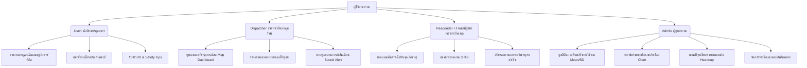

# 🛡️ ระบบรายงานเหตุฉุกเฉินและเผชิญภัยพิบัติภายในมหาวิทยาลัย (Campus Incident Reporting & Emergency Response System)

ยินดีต้อนรับสู่โปรเจกต์ระบบความปลอดภัยอัจฉริยะภายในพื้นที่มหาวิทยาลัย แอปพลิเคชันนี้ถูกพัฒนาขึ้นด้วย **Flutter** และใช้ระบบเบื้องหลังเป็น **Firebase Cloud Services** โดยสมบูรณ์ เพื่อลดเวลาการตอบสนองต่อภัยพิบัติและเหตุฉุกเฉินแบบเรียลไทม์ (Real-time Integration)

---

## 🎯 คอนเซ็ปต์การทำงานของระบบ (System Concept & Core Workflow)

**แอปพลิเคชันระบบรายงานเหตุฉุกเฉินและเผชิญภัยพิบัติอัจฉริยะ (Campus Emergency Response Platform)**
ไม่ใช่แพลตฟอร์มจับคู่ตรงแบบ 2 ฝ่ายทั่วไป แต่เป็น **"ระบบบริหารจัดการและประสานงานเหตุฉุกเฉิน 3 ฝ่ายเรียลไทม์ (3-Tier Emergency Coordination System)"** ที่มีประสิทธิภาพเทียบเท่าศูนย์สั่งการมาตรฐานสากล (Command & Control Center) โดยแบ่งสิทธิ์การทำงานและความปลอดภัยแยกขาดจากกันอย่างชัดเจน ดังนี้:

1. **ผู้แจ้งเหตุ (Reporter / นักศึกษาและบุคลากร):** ผู้ประสบภัยหรือพบเห็นภัยเหตุฉุกเฉิน
2. **ศูนย์วิทยุประสานงาน (Dispatcher):** ตัวกลางและสมองหลักของระบบ ทำหน้าที่ตรวจสอบคัดกรองเคส ตรวจสอบพิกัด และ **จ่ายงานแบบเจาะจง (Manual Assign)** ให้กับเจ้าหน้าที่กู้ภัยที่สแตนด์บายอยู่
3. **เจ้าหน้าที่กู้ภัย/หน่วยเผชิญเหตุ (Responder):** หน่วยกู้ภัยที่เคลื่อนที่เร็วเพื่อลงพื้นที่ระงับเหตุจริง

### 🚀 ขั้นตอนการประสานงานจริงของแอปพลิเคชัน (Actual Application Flow)

* **การส่งเรื่องแจ้งเหตุ (Smart Reporting):**
  * เมื่อผู้แจ้งกดรายงานเหตุผ่านแอปพลิเคชัน ระบบจะทำการดึงพิกัดละติจูด/ลองจิจูดความละเอียดสูง (GPS) จากสมาร์ทโฟน **ในลักษณะเบื้องหลัง (Background Fetch)** ทันทีที่เปิดหน้าจอ ทำให้ส่งเหตุได้รวดเร็วโดยไม่ต้องเสียเวลาอธิบายเส้นทาง 
  * ผู้แจ้งสามารถระบุประเภทภัย (อุบัติเหตุ, ไฟไหม้, การแพทย์, ความปลอดภัย, สาธารณูปโภค หรือขอความช่วยเหลืออื่นๆ) พร้อมแนบรูปถ่ายสภาพหน้างานจริงแบบเรียลไทม์ และประเมินระดับความสำคัญของเหตุ (Priority: ทั่วไป, ปานกลาง, เร่งด่วน, วิกฤต)

* **การบริหารจัดการภัยและส่งสัญญาณแจ้งเตือน (Dispatching Engine):**
  * เหตุการณ์ที่ถูกส่งจะเด้งเข้าสู่ **"แผงสั่งการวิทยุ (Dispatcher Screen)"** ของเจ้าหน้าที่กลางในทันทีแบบเรียลไทม์ และเปิดการแจ้งเตือนเสียงฉุกเฉิน (**Sound Alert Service**) เพื่อให้เจ้าหน้าที่รีบตรวจภัย
  * ศูนย์ประสานงานสั่งการกลางจะตรวจพิกัดผ่าน **"แผนที่สัญญานสด (Map Dashboard)"** และกดมอบหมายเคสงานให้แก่เจ้าหน้าที่กู้ภัย (Responder) 
  * เมื่อจ่ายงาน ระบบหลังบ้านจะสั่งงานไปยัง **Firebase Cloud Functions (ภูมิภาค `asia-southeast1` สิงคโปร์)** เพื่อยิง **Push Notification (FCM)** ตรงเข้ามือถือของเจ้าหน้าที่กู้ภัยเป้าหมายในทันที

* **การเดินทางนำทางและการติดต่อผู้แจ้ง (Smart Navigation & Hot Call):**
  * แอปพลิเคชันฝั่งกู้ภัยจะได้รับข้อความ Push เด้งแจ้งเตือน แสดงข้อมูลเบื้องต้นทันที (เช่น ประเภทอุบัติเหตุ, ระดับความรุนแรง, ชื่อผู้แจ้ง)
  * กู้ภัยสามารถกดปุ่ม **"โทรหาผู้แจ้ง"** เพื่อสอบถามอาการหรือนำทางสดได้ทันทีผ่านระบบโทรศัพท์หลักของตัวเครื่อง (`url_launcher`)
  * ระบบมีหน้าแผนที่นำทางอัจฉริยะ (**Adaptive Map Navigator** ที่เป็น Google Maps บน Android และ OpenStreetMap บน Web เบราว์เซอร์) เพื่อลากเส้นทางนำทางไปยังพิกัดละติจูด/ลองจิจูดของเหตุดังกล่าวอย่างรวดเร็ว

* **วงจรการปฏิบัติงานระงับเหตุของกู้ภัย (Premium Journey Actions):**
  เมื่อกู้ภัยเดินทางและเข้าช่วยเหลือหน้างาน กู้ภัยจะมีฟังก์ชันการอัปเดตสเตตัสความคืบหน้าแบ่งออกเป็น 3 ขั้นตอนหลัก ตามกฎทางธุรกิจของแอป (Business Logic Flow):
  * **เริ่มออกเดินทาง (En Route):** เพื่อแจ้งให้ผู้ประสบภัยทราบความเคลื่อนไหวว่ากู้ภัยกำลังไปหา
  * **ถึงจุดเกิดเหตุ (Arrived):** เมื่อกู้ภัยเข้าทำการช่วยเหลือจริงหน้างาน (เช่น ปฐมพยาบาลเบื้องต้น)
  * **เสร็จสิ้นภารกิจ (Complete/Resolved):** เมื่อเหตุการณ์ได้รับการคลี่คลายเรียบร้อย กู้ภัยจะกดปิดเคสเพื่อเปลี่ยนสเตตัสเหตุเป็น **`RESOLVED`** ซึ่งจะเปิดโอกาสให้ผู้แจ้งสามารถทำแบบประเมิน UAT ให้คะแนนดาว (UAT Stars Rating) และส่งข้อมูลคำติชมกลับมายังผู้ดูแลระบบ (Admin) เพื่อใช้ในการตรวจสอบเชิงสถิติต่อไป

---

## 🌟 ฟังก์ชันการทำงานหลักตามบทบาทการใช้งาน (Roles & Core Features)

ระบบนี้รองรับกลุ่มผู้ใช้หลัก 4 กลุ่มการทำงาน โดยมีสิทธิ์และความปลอดภัยแบ่งแยกหน้าที่อย่างเด็ดขาด (Role-Based Access Control):



### 1. 👤 บทบาทผู้ใช้งานทั่วไป (User)
* **รายงานเหตุฉุกเฉินแบบเรียลไทม์:** เลือกประเภทภัย แนบคำอธิบาย รูปภาพ และระบุพิกัดละติจูด/ลองจิจูดจากแผนที่
* **ระบบแชทติดต่อช่วยเหลือ:** ช่องแชทส่วนตัวกับเจ้าหน้าที่เพื่ออัปเดตสถานการณ์และความปลอดภัย
* **ศูนย์ข่าวสารและประกาศภัย (Announcements):** รับข้อมูลแจ้งเตือนฉุกเฉินจากทางมหาวิทยาลัย
* **คำแนะนำความปลอดภัย (Safety Tips):** คลังความรู้แนะนำวิธีรับมือภัยพิบัติต่างๆ

### 2. 📡 บทบาทเจ้าหน้าที่รับเรื่องและวิทยุสื่อสาร (Dispatcher)
* **แผงควบคุมเหตุการณ์ (Incident Panel):** ตรวจสอบเคสใหม่ที่ส่งเข้ามา เปลี่ยนสเตตัส และมอบหมายงานให้ทีมเผชิญเหตุ
* **ระบบจ่ายงานอัจฉริยะ:** ค้นหาเจ้าหน้าที่กู้ภัยที่สแตนด์บายในแต่ละจุดและมอบหมายอย่างรวดเร็ว
* **แผงแผนที่นำทางสด (Map Dashboard):** แสดงตำแหน่งเหตุการณ์ทุกเคสในแผนที่เดียวเพื่อการบริหารจัดการพื้นที่
* **ระบบเสียงแจ้งเตือนฉุกเฉิน (Sound Alerts):** ส่งสัญญาณเตือนเมื่อมีเคสระดับวิกฤต (Critical) เข้ามาในระบบ

### 3. 🚑 บทบาทเจ้าหน้าที่กู้ภัยและเผชิญเหตุ (Responder)
* **ระบบแดชบอร์ดกู้ภัย (Responder Dashboard):** รายการเคสที่ได้รับมอบหมายและสถานะความเร็วในการปฏิบัติงาน
* **แผนที่นำทางอัจฉริยะ (Adaptive Map Navigation):** ระบบแผนที่แบบ Cross-platform (Google Maps บน Android / OpenStreetMap บน Web) เพื่อนำทางไปยังพิกัดเกิดเหตุ
* **ระบบแชทประสานงาน:** แชทติดต่อตรงกับ Dispatcher และผู้แจ้งเหตุเพื่อส่งความช่วยเหลือได้อย่างมีประสิทธิภาพ
* **การบันทึกสรุปสถานการณ์:** บันทึกข้อมูลและปิดเคสเป็น "เสร็จสิ้น" (RESOLVED)

### 4. 🔧 บทบาทผู้ดูแลระบบ (Admin)
* **สถิติความพึงพอใจและ UAT Stats:** คำนวณค่าเฉลี่ย (Mean), ส่วนเบี่ยงเบนมาตรฐาน (SD) และกลุ่มตัวอย่างอัตโนมัติจากการประเมินผลของผู้แจ้งเหตุ
* **ผลวิเคราะห์ประเภทภัย (Incident Analytics):** แสดงแผนภูมิแท่ง (Bar Chart) วิเคราะห์ประเภทการแจ้งเหตุสูงสุด
* **แผนที่ความร้อนพื้นที่อันตราย (Risk Heatmap):** แผนที่การกระจายตัวของเหตุการณ์เพื่อใช้วิเคราะห์จุดเสี่ยงภัยในพื้นที่มหาวิทยาลัย
* **การจัดการสิทธิ์และสมาชิก (User Management):** เปลี่ยนแปลงบทบาทหน้าของบุคลากรในโครงการ

---

## 📂 โครงสร้างซอร์สโค้ดที่มีระเบียบและ Lean (Project Structure)

ซอร์สโค้ดของโครงการได้รับการ Lean และจัดระเบียบตามรูปแบบ **Feature-First Architecture** ทำให้ดูแลรักษาง่ายและง่ายต่อการอ้างอิงตอบคำถามกรรมการ:

```text
lib/
├── core/                           # โค้ดส่วนกลางและค่าคอนฟิกหลักของระบบ
│   ├── adaptive_map_widget.dart    # วิดเจ็ตแผนที่รองรับ Mobile (Google) และ Web (OSM)
│   ├── app_localizations.dart      # การตั้งค่ารองรับภาษา
│   ├── app_network_image.dart      # วิดเจ็ตโหลดและจัดการ Cache รูปภาพจากระบบคลาวด์
│   ├── constants.dart              # ค่าคงที่ระบบ (บทบาทผู้ใช้, สถานะเหตุ, ประเภทภัย)
│   ├── helpers.dart                # ฟังก์ชันตัวช่วยอำนวยความสะดวก (การจัดฟอร์แมตสี/เวลา)
│   ├── providers.dart              # จุดศูนย์กลางของ Riverpod (State Management Providers)
│   ├── remote_config_service.dart  # บริการควบคุมฟังก์ชันแอปผ่านระบบคลาวด์
│   ├── session_timeout.dart        # ระบบความปลอดภัย ตัดเซสชันอัตโนมัติเมื่อไม่มีการเคลื่อนไหว
│   ├── theme.dart                  # ระบบสีและสไตล์ของแอปพลิเคชัน (รองรับ Dark Mode)
│   ├── version_check.dart          # ระบบตรวจสอบและบังคับอัปเดตแอปเวอร์ชันใหม่
│   ├── web_notification.dart       # สัญญาระบบแจ้งเตือนสำหรับแพลตฟอร์มเว็บ (Interface Contract)
│   ├── web_notification_impl.dart  # ส่วนติดตั้งระบบแจ้งเตือนจริงของแพลตฟอร์มเว็บ (HTML Web Notifications)
│   └── web_notification_stub.dart  # ไฟล์ Stub สำหรับป้องกันการพังระหว่างการคอมไพล์บนอุปกรณ์เคลื่อนที่
│
├── features/                       # โฟลเดอร์รวมฟังก์ชันการทำงานหลัก (Feature-First)
│   ├── announcement/               # ฟีเจอร์ประกาศข่าวสารฉุกเฉิน
│   │   └── announcement_screen.dart # หน้าจอลิสต์ประกาศแจ้งข่าวเตือนภัยพิบัติจากมหาวิทยาลัย
│   │
│   ├── auth/                       # ฟีเจอร์ระบบสมัครสมาชิก ยืนยันสิทธิ์ และการนำทาง
│   │   ├── data/
│   │   │   └── auth_repository.dart # คลาส Repository จัดการระบบ Firebase Authentication และ Firestore User Profile
│   │   └── presentation/
│   │       ├── login_screen.dart   # หน้าจอลงชื่อเข้าใช้ (รองรับการเช็ค Session, รหัสผ่าน, และ Biometrics)
│   │       ├── register_screen.dart # หน้าจอลงทะเบียนสมาชิกใหม่ พร้อมระบบระบุบทบาทเบื้องต้น
│   │       └── role_redirect.dart  # หน้าจอตรวจสอบสิทธิ์บทบาทและกระจายผู้ใช้ไปตามแดชบอร์ดการทำงานจริง
│   │
│   ├── chat/                       # ฟีเจอร์สื่อสารประสานงานเรียลไทม์ (Real-time Communication)
│   │   ├── data/
│   │   │   ├── chat_repository.dart       # จัดการข้อมูลการคุยแชทของห้องแชทกลางระหว่าง Dispatcher
│   │   │   └── direct_chat_repository.dart # จัดการข้อความคุยแชทส่วนตัวระหว่างเจ้าหน้าที่กู้ภัยและผู้ส่งเรื่อง
│   │   └── presentation/
│   │       ├── chat_history_screen.dart   # หน้าจอแสดงประวัติการพูดคุยทั้งหมด
│   │       ├── chat_screen.dart           # ห้องแชทพูดคุยกลางสำหรับการบริหารสถานการณ์
│   │       └── direct_chat_screen.dart    # ห้องแชทส่วนตัวเพื่อระบุรายละเอียดความช่วยเหลือหน้างาน
│   │
│   ├── dispatcher/                 # ฟีเจอร์แผงควบคุมและจ่ายงานของเจ้าหน้าที่วิทยุ (ศูนย์บัญชาการ)
│   │   ├── dispatcher_screen.dart       # หน้าจอแผงควบคุมหลักสำหรับจ่ายงานและประมวลเหตุการณ์สด
│   │   ├── dispatcher_stats_widget.dart  # ส่วนย่อยประมวลผลยอดการทำงานของเจ้าหน้าที่และเวลาเฉลี่ย
│   │   ├── incident_panel.dart          # แผงตรวจสอบเคสใหม่ เปลี่ยนระดับความสำคัญ และจ่ายงาน
│   │   ├── line_share_helper.dart       # ตัวช่วยสำหรับการแชร์ลิงก์ข้อมูลเหตุฉุกเฉินตรงไปยังกลุ่มแอป LINE
│   │   ├── map_dashboard_screen.dart    # หน้าจอแผงแผนที่รวม แสดงหมุนพิกัดเหตุการณ์สดทุกจุดในมหาวิทยาลัย
│   │   ├── resolved_incidents_panel.dart # แผงประวัติและข้อมูลเหตุการณ์ทั้งหมดที่ได้รับการระงับสำเร็จแล้ว
│   │   ├── responders_panel.dart        # แผงแสดงรายชื่อและตำแหน่งสแตนด์บายของเจ้าหน้าที่กู้ภัย
│   │   └── sound_alert_service.dart     # ระบบบริการเสียงสั่นเตือนฉุกเฉินเมื่อได้รับแจ้งเหตุวิกฤต (Critical)
│   │
│   ├── home/                       # ฟีเจอร์สำหรับกลุ่มนักศึกษาและบุคลากรทั่วไป
│   │   └── home_screen.dart        # หน้าจอ Dashboard หลักสำหรับกดรายงานเหตุ ดูประกาศย่อ และ Safety Tips
│   │
│   ├── incident/                   # ฟีเจอร์หลักในการแจ้งเหตุ บันทึกเหตุ และอัปเดตสเตตัสสด
│   │   ├── data/
│   │   │   └── incident_repository.dart     # ตัวจัดการคำขอสร้างเหตุ ปิดเหตุ อัปโหลดรูปภาพ และดึงล็อกการทำงาน
│   │   ├── domain/
│   │   │   └── responder_logic.dart         # กฎทางธุรกิจควบคุมสเตตัสของแอป (NEW -> IN_PROGRESS -> RESOLVED)
│   │   └── presentation/
│   │       ├── choose_report_type_screen.dart # หน้าจอเลือกประเภทของภัยฉุกเฉิน
│   │       ├── incident_detail_screen.dart   # รายละเอียดเหตุการณ์ บันทึกประวัติ อัปโหลดวิดีโอ/รูป และประเมิน UAT Stars
│   │       ├── incident_list_screen.dart     # รายการแสดงประวัติเคสทั้งหมดที่รายงานหรืออยู่ในการปฏิบัติงาน
│   │       └── report_incident_screen.dart   # หน้าจอลงฟอร์มแจ้งเหตุ แนบสื่อ ถ่ายภาพสด และปักพิกัดเกิดเหตุ
│   │
│   ├── map/                        # ฟีเจอร์วิเคราะห์พิกัดจุดเสี่ยงสำหรับผู้ดูแลระบบ
│   │   └── heatmap_screen.dart     # หน้าจอแผนที่ความหนาแน่นจุดเสี่ยงภัยในพื้นที่มหาวิทยาลัยด้วย Circles Overlay
│   │
│   ├── notification/               # ฟีเจอร์ระบบควบคุมสัญญาณแจ้งเตือนและระบบ Push Notification
│   │   ├── notification_router.dart   # คลาสคอยจับเหตุการณ์กดแถบ Notification เพื่อนำทางไปยังหน้าจอแชท/เหตุนั้นๆ
│   │   ├── notification_service.dart  # บริการควบคุมลงทะเบียน FCM Token, แชนเนลเสียง และ Push ข้อความข้ามระบบ
│   │   └── web_notification_watcher.dart # ตัวคอยฟังสถานะ (Watcher) เพื่อดึงข้อความแจ้งเตือนมาแสดงผลบนเว็บแอป
│   │
│   ├── onboarding/                 # ฟีเจอร์การต้อนรับผู้ใช้ใหม่
│   │   └── onboarding_screen.dart  # สไลด์แนะนำภาพรวมฟังก์ชันความพร้อมใช้งานของแอปพลิเคชัน
│   │
│   ├── profile/                    # ฟีเจอร์หน้าต่างข้อมูลส่วนบุคคล
│   │   └── profile_screen.dart     # ดูประวัติ บันทึกรูปโปรไฟล์ แก้ไขข้อมูล และออกจากระบบ
│   │
│   ├── responder/                  # ฟีเจอร์สิทธิ์การปฏิบัติหน้าที่หน้างานของเจ้าหน้าที่เผชิญเหตุ
│   │   ├── navigator_screen.dart   # หน้าจอระบบนำทางพิกัดอัจฉริยะ (Adaptive Google/OSM Maps) เพื่อระงับภัย
│   │   └── responder_dashboard.dart # แดชบอร์ดหลักของกู้ภัย แสดงยอดเคสและรายการเคสที่ตนเองได้รับมอบหมาย
│   │
│   └── safety/                     # ฟีเจอร์ชุดคลังความรู้การป้องกันตัว
│       └── safety_tips_screen.dart # หน้าจอแสดงรายชื่อคำแนะนำ วิธีการระงับเหตุและช่วยเหลือชีวิตเบื้องต้น
│
├── models/                         # โครงสร้างโมเดลข้อมูลส่วนกลาง
│   └── incident_model.dart         # โครงสร้างคลาสเหตุการณ์และการแปลงข้อมูล Firestore
│
├── firebase_options.dart           # การตั้งค่าบริการคลาวด์แยกตามแพลตฟอร์ม (รองรับ Android และ Web)
└── main.dart                       # จุดเริ่มต้นรันโปรแกรมและการควบคุมธีม
```

---

## 🛠️ เทคโนโลยีสแต็กและการผสานรวมระบบคลาวด์ (Tech Stack & Cloud Integrations)

* **UI Engine:** Flutter SDK 3.x (ภาษา Dart)
* **ฐานข้อมูล & แบ็คเอนด์:** 
  * **Firebase Authentication:** การสมัครและยืนยันตัวตนสมาชิกแยกตามบทบาท (User, Dispatcher, Responder, Admin)
  * **Cloud Firestore:** ฐานข้อมูล NoSQL แบบเรียลไทม์สำหรับบันทึกเคสเหตุ แชทข้อความ และประกาศข่าวสาร
  * **Cloud Storage:** พื้นที่ฝากไฟล์สื่อ รูปภาพหลักฐานการแจ้งเหตุ และรูปโปรไฟล์
  * **Firebase Cloud Messaging (FCM):** แจ้งเตือนฉุกเฉินบนอุปกรณ์มือถือ
  * **Firebase Remote Config:** ใช้ตั้งค่าข้อความประกาศและตรวจสอบหมายเลขเวอร์ชันของแอปพลิเคชัน
  * **Firebase Cloud Functions:** รันสคริปต์ส่งการแจ้งเตือนอัตโนมัติเบื้องหลัง (เขียนด้วย JavaScript/Node.js และ Deploy ไปยังภูมิภาค `asia-southeast1` สิงคโปร์ เพื่อรองรับ Firestore Triggers และ Multicast push notifications ได้รวดเร็วที่สุด)

---

## 🚀 ขั้นตอนการติดตั้งและการเริ่มต้นใช้งานแอปพลิเคชัน (Getting Started)

### 1. ความต้องการของระบบ (Prerequisites)
* ติดตั้ง **Flutter SDK** ล่าสุด
* ตั้งค่า **Android Studio** หรือ **VS Code** พร้อมปลั๊กอิน Flutter & Dart

### 2. การดาวน์โหลดและเตรียมไลบรารี
รันคำสั่งเหล่านี้ในรูทโฟลเดอร์โครงการเพื่อดึงปลั๊กอินที่เกี่ยวข้องทั้งหมด:

```bash
# อัปเดตและดาวน์โหลดแพ็คเกจส่วนขยาย
flutter pub get

# ตรวจสอบสภาพแวดล้อมและความเรียบร้อยของโค้ด
flutter analyze
```

### 3. การรันตัวโปรแกรม (Running the App)
* **สำหรับอุปกรณ์เคลื่อนที่ (Android Emulator / อุปกรณ์จริง):**
  ```bash
  flutter run -d android
  ```
* **สำหรับรันบนเบราว์เซอร์เว็บ (Google Chrome):**
  ```bash
  flutter run -d chrome
  ```

---

## 🔒 กฎความปลอดภัยของระบบคลาวด์ (Security Configuration)

ความปลอดภัยและการเขียนทับข้อมูลได้รับการป้องกันอย่างรัดกุมผ่านไฟล์การตั้งค่าความปลอดภัยของ Firebase:
* **Firestore Rules (`firestore.rules`):** ควบคุมการเข้าถึงเอกสารอย่างเข้มงวด โดยผู้ใช้งานทั่วไปแก้ไขได้เฉพาะเหตุของตนเอง และเจ้าหน้าที่ที่ได้รับสิทธิ์เท่านั้นที่สามารถเปลี่ยนแปลงข้อมูลหลักได้
* **Storage Rules (`storage.rules`):** ควบคุมสิทธิ์การอัปโหลดไฟล์สื่อหลักฐานโดยจำกัดขนาดไฟล์ไม่เกิน 5MB และรองรับการดึงข้อมูลเฉพาะประเภทรูปภาพและเสียงเพื่อความปลอดภัยสูงสุด
