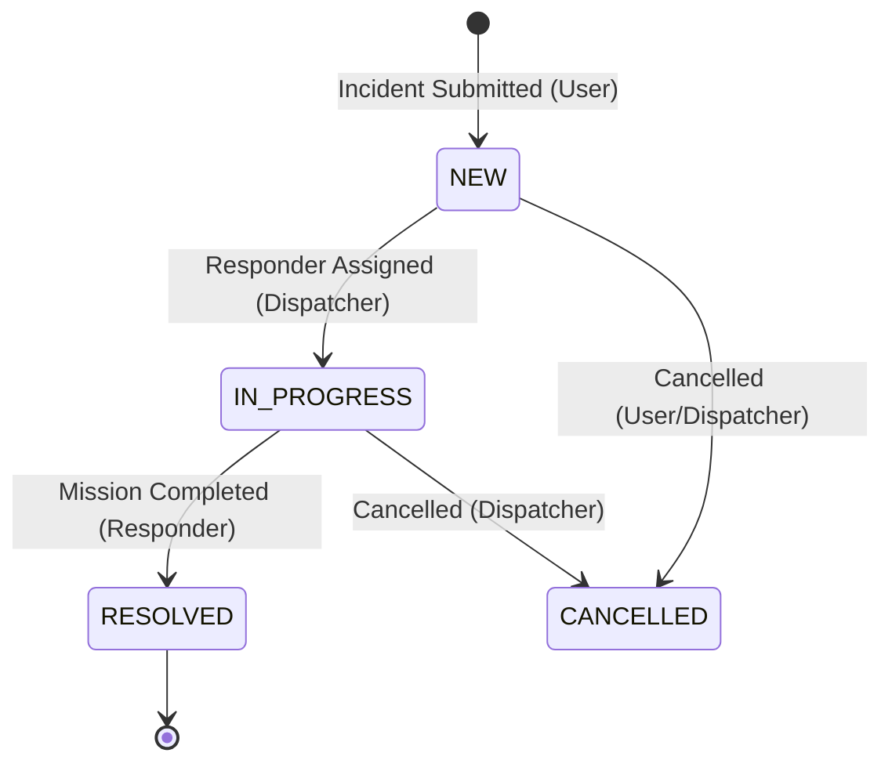

# SUT Campus Incident System — Comprehensive Technical Audit & System Documentation

This document serves as the master architectural specification and technical audit of the **SUT Campus Incident System**. It is compiled from a deep code-level reverse-engineering audit of the repository located at `a:\mobile_user_app\mobile_user_app - สำเนา (3)`.

---

## 1. Executive Summary

The SUT Campus Incident System is an enterprise-grade, highly responsive emergency response and safety monitoring system custom-built for **Suranaree University of Technology (SUT)**. It addresses key latency problems in traditional campus security dispatches by providing a cross-platform (Web, Android, iOS, Windows) workspace that links three separate stakeholders in real time:
1.  **Campus Students / Staff (Users)**: Quick emergency reporter console with coordinates tracking and multi-image uploads.
2.  **Dispatchers (Command Center)**: A dual-layout dashboard with real-time responsive mapping, responder stats, active workloads, and audit log controls.
3.  **Responders (Safety / Medical / Rescue Teams)**: Dashboard with live routing, timeline updates, and dynamic DMs.

### Technical Achievements
*   **True Cross-Platform Map Compatibility**: Unified wrapper mapping Google Maps (mobile native) and Leaflet/OpenStreetMap (web/desktop).
*   **$O(1)$ Workload Dispatching Optimization**: Avoids expensive N+1 collection checks by compiling in-memory workload counts.
*   **Zero-Email Recovery Abstraction**: GSuite-style virtual logins mapped to standard Firebase Auth credentials, with an independent, secure dual-step phone verification password recovery flow.
*   **Double-Notification Suppression Engine**: Tracks active chat/DM rooms globally inside a web watcher state to immediately suppress duplicate audible/visual alerts if the user is currently viewing the chat.

---

## 2. Application Overview

The system operates as a unified, real-time crisis management ecosystem. The workflow functions as a state machine:



### Core Stakeholder Features
*   **The User Console**: Offers instant incident category selection (Security, Medical, Accident, Facility, General Assistance), description input, live GPS coordinate polling, and multi-image attachment uploads.
*   **The Dispatcher Console**: A command hub that displays an interactive layout with live markers showing incident locations and responder tracking. It includes responder score tables compiled dynamically using geographical distance and active task counts.
*   **The Responder Console**: A mobile dashboard that allows responders to accept incidents and cycle through standard operational milestones (`ACCEPTED` $\rightarrow$ `EN_ROUTE` $\rightarrow$ `ARRIVED` $\rightarrow$ `RESOLVED`). It provides real-time geographic routing and a built-in direct chat channel to communicate with the command center.

---

## 3. Folder Structure Analysis

The client app is structured around a feature-first Clean Architecture directory design. This isolates distinct logic domains and separates representation components. Below is the detailed structure of the core codebase:

```
lib/
├── main.dart                       # App entry point, bootstrap, remote config & Firebase AuthGate
├── core/                           # Foundation modules, shared helper services, and adapters
│   ├── adaptive_map_widget.dart    # Leaflet (web) & Google Maps (native) unified API
│   ├── constants.dart              # Core lists, categories, and system metadata
│   ├── helpers.dart                # Shared regexes, coordinate calculations, and formatters
│   ├── providers.dart              # Global Riverpod dependencies and streams catalog
│   ├── session_timeout.dart        # Session monitor wrapper (auto-logout bypass)
│   ├── theme.dart                  # Curated Outfit-typography and HSL SUT-Orange styling
│   ├── version_check.dart          # Semver checker connected to Firestore config
│   ├── web_notification.dart       # Platform-level JS interop selector entry point
│   ├── web_notification_impl.dart  # Web JS interop implementation (Vibration, Audio, notifications)
│   └── web_notification_stub.dart  # Mobile/Windows stub fallback
├── models/                         # Common data serialization contracts
│   ├── incident_model.dart         # Maps details, media urls, read receipts, and timelines
│   └── user_model.dart             # Maps roles, departments, points, and tracking positions
└── features/                       # Modular business domains containing clean logic layers
    ├── admin/                      # System administration, responder registration, and points panels
    ├── announcement/               # Global safety bulletins and responsive card carousels
    ├── auth/                       # virtual-email login and phone-based credential recovery
    │   ├── data/auth_repository.dart
    │   └── presentation/login_screen.dart, register_screen.dart, role_redirect.dart
    ├── chat/                       # Real-time incident group chat rooms & DMs
    │   ├── data/chat_repository.dart, direct_chat_repository.dart
    │   └── presentation/chat_screen.dart, direct_chat_screen.dart
    ├── dispatcher/                 # Command center, workload maps, and suggestion panels
    │   ├── dispatcher_screen.dart
    │   ├── sound_alert_service.dart
    │   └── responders_panel.dart, dispatcher_stats_widget.dart
    ├── home/                       # User dashboard, category grids, and incident reporting forms
    ├── incident/                   # Business rules for state compliance, F5 assignment and F6 GPS tracking
    │   ├── data/incident_repository.dart
    │   └── domain/responder_logic.dart
    ├── notification/               # Multicast FCM gateways and background isolate handlers
    └── profile/                    # Profile settings, volunteer score boards, and detail editors
```

---

## 4. Architecture Analysis

The system enforces a **Clean Architecture** combined with a **Feature-First Layering** strategy:

```
        ┌────────────────────────────────────────────────────────┐
        │                   PRESENTATION LAYER                   │
        │  (UI Widgets, Responsive Panels, Screens, Controllers)  │
        └───────────────────────────┬────────────────────────────┘
                                    │ Watches
                                    ▼
        ┌────────────────────────────────────────────────────────┐
        │                      DOMAIN LAYER                      │
        │       (State Transition Rules, Validation Logic)        │
        └───────────────────────────┬────────────────────────────┘
                                    │ Invokes
                                    ▼
        ┌────────────────────────────────────────────────────────┐
        │                       DATA LAYER                       │
        │  (Repositories, Firebase Auth/Firestore, FCM Services) │
        └────────────────────────────────────────────────────────┘
```

*   **Presentation Layer**: Built with responsive widgets (`LayoutBuilder` transitions for desktop vs mobile). Widgets watch providers to display UI configurations without maintaining local copy states.
*   **Domain Layer**: Encapsulated in files like `responder_logic.dart`. It acts as a gatekeeper, verifying that state changes adhere to valid rules (e.g. preventing moving an incident to `RESOLVED` directly from `NEW`).
*   **Data Layer**: Encapsulated inside concrete repository classes (`AuthRepository`, `IncidentRepository`, `ChatRepository`, `DirectChatRepository`). It translates Firestore operations, maps JSON entities, and manages FCM network requests.

---

## 5. Dependency Analysis

The project dependencies are declared in [pubspec.yaml](file:///a:/mobile_user_app/mobile_user_app%20-%20%E0%B8%AA%E0%B8%B3%E0%B9%80%E0%B8%99%E0%B8%B2%20%283%29/pubspec.yaml). Key packages and their specific usage within the codebase are outlined below:

```yaml
dependencies:
  flutter:
    sdk: flutter
  flutter_riverpod: ^2.3.6          # Global stream bindings & dependency injection (providers.dart)
  firebase_core: ^2.15.0            # Initializes Firebase inside main.dart
  firebase_auth: ^4.7.0             # User virtual logins & token authentication (auth_repository.dart)
  cloud_firestore: ^4.8.0           # Real-time database queries & triggers (incident_repository.dart)
  firebase_storage: ^11.2.4         # Incident image uploads (incident_repository.dart)
  firebase_messaging: ^14.6.4       # Handles FCM remote messages & payloads (notification_service.dart)
  cloud_functions: ^4.3.4           # Remote HTTPS Callable functions triggers (auth_repository.dart)
  google_maps_flutter: ^2.4.0       # Mobile interactive mapping rendering (adaptive_map_widget.dart)
  flutter_map: ^6.0.0               # Leaflet-based desktop/web open-source mapping wrapper
  latlong2: ^0.9.0                  # Coordinate data types for leaflet mapping
  geolocator: ^10.0.1               # Polling live GPS coordinates & permissions (incident_repository.dart)
  flutter_local_notifications: ^15.1.0+1 # Shows native OS HUD alerts for notifications on Android/iOS
  audioplayers: ^5.2.1              # Play local assets sound alerts on desktop/mobile (sound_alert_service.dart)
  package_info_plus: ^4.0.2         # Extracts client semver to match minimum constraints (version_check.dart)
  introduction_screen: ^3.1.1       # Renders initial onboarding guides on first run (main.dart)
  fl_chart: ^0.63.0                 # Renders dashboard stats charts for dispatchers
```

---

## 6. Import Analysis

The system relies on a clean module import structure to ensure high testability and prevent cyclic compiler loops:

```
                  ┌──────────────────────┐
                  │      main.dart       │
                  └──────────┬───────────┘
                             │
                             ▼
               ┌───────────────────────────┐
               │    core/providers.dart    │
               └─────────────┬─────────────┘
                             │
            ┌────────────────┴────────────────┐
            ▼                                 ▼
┌────────────────────────┐        ┌────────────────────────┐
│  auth_repository.dart  │        │ incident_repository.dart│
└────────────────────────┘        └────────────────────────┘
            │                                 │
            ▼                                 ▼
┌────────────────────────┐        ┌────────────────────────┐
│   user_model.dart      │        │  incident_model.dart   │
└────────────────────────┘        └────────────────────────┘
```

*   **Global Provider Hook**: [providers.dart](file:///a:/mobile_user_app/mobile_user_app%20-%20%E0%B8%AA%E0%B8%B3%E0%B9%80%E0%B8%99%E0%B8%B2%20%283%29/lib/core/providers.dart) serves as the dependency injection registry. Repositories are exposed via simple providers, decouple-loading dependencies like `FirebaseFirestore` or `FirebaseAuth`.
*   **Decoupled Navigation**: Deep links from notifications are mapped through a static router [notification_router.dart](file:///a:/mobile_user_app/mobile_user_app%20-%20%E0%B8%AA%E0%B8%B3%E0%B9%80%E0%B8%99%E0%B8%B2%20%283%29/lib/features/notification/notification_router.dart), keeping routing pathways independent of the core features UI components.

---

## 7. Features Analysis

### F1: Incident Reporting System
Allows users to report incidents quickly. They can select categories, write descriptions, poll GPS coordinates with 10-meter precision using `Geolocator`, and upload multiple files to `/incident_images` on Firebase Storage. The system saves the report as a document under `/incidents`.

### F2: virtual GSuite Identity Abstraction
Simplifies authentication by removing email requirements for university users. When a user registers or logs in using their numeric/alphanumeric Student/Staff ID (e.g. `B1234567`), the `AuthRepository` normalizes the ID to uppercase and appends a virtual domain `@campus.local` behind the scenes. This allows the system to use standard, production-ready Firebase Auth `signInWithEmailAndPassword` under the hood.

### F3: Dual-Step Phone-Based Password Recovery
Provides a secure recovery pipeline without email or OTP overhead:
*   **Step 1: Identity Verification**: A Cloud Function verifies if the requested Student/Staff ID and telephone number match an active record.
*   **Step 2: Password Update**: If verified, the client updates the password via a secure Node.js Cloud Function. This function uses the `firebase-admin` SDK to bypass standard client password write blocks.

### F4: Real-time UI & Reactive Streams
Uses Riverpod `StreamProvider` wrappers (`currentUserProvider`, `authStateProvider`) to bind UI state to Firestore snapshots. When data is modified—such as points being updated, or responder coordinates shifting—widgets auto-rebuild.

### F5: Suggestion-Based Assignment System
An assignment panel that recommends the best responder for a given incident based on a 3-part scoring logic:
1.  **Department Match (+3 points)**: Matches responder departments (e.g. `hospital`) to incident types (e.g. `medical`).
2.  **Workload Filter (+2 points)**: Scans active workloads; responders with fewer than 2 active tasks receive a bonus.
3.  **Proximity Search (+1 point)**: Adds points if the responder is within a 1.0 km radius, calculated using the Haversine formula against their last recorded location.

### F6: Live Responder GPS Tracking
Active responders update their geographic position via a background loop. The coordinates are stored under `users/{uid}/lastLocation`. A real-time stream `getRespondersLocationStream()` allows dispatchers to monitor all responder locations simultaneously on the command map.

### F7: Multi-Format Live Chat (Incident Channels & DMs)
Enables immediate communication between responders, reporters, and dispatchers:
*   **Incident Chats**: Dedicated channels located at `/incidents/{incidentId}/messages` for all active incident participants.
*   **Direct Messages**: Direct channels at `/direct_messages/{chatId}/messages` for communication between responders and dispatchers. Both platforms sync instantly using Firestore collections snapshots.

### F8: In-App Double-Notification Suppression Engine
Solves the issue of redundant notification sound loops. A global state tracker `WebNotificationWatcher` stores active panel identifiers (`activeIncidentChatId`, `activeDmChatId`). When new snapshots arrive, the system checks if the user is currently viewing that chat. If they are, it suppresses the audible chimes and visual popups, while other chats still trigger the alerts normally.

### F9: Responsive Dual-Layout Core
Uses Flutter's `LayoutBuilder` to support multiple device layouts from a single codebase:
*   **Mobile Screens (< 700px)**: Renders a streamlined, sequential bottom-bar navigation interface.
*   **Large Screens / Desktop**: Renders a multi-pane split-screen console. For example, the dispatcher console shows statistics, active list panels, and an interactive map side-by-side.

### F10: Cross-Platform Sound Notification Pipeline
Supports audio notifications across different environments:
*   **Mobile / Native Client**: Plays local chime assets via `audioplayers`.
*   **Web Client**: Triggers clean notification beeps by wrapping Web Audio API chimes directly inside JavaScript Interop functions.

---

## 8. Function-Level Analysis

Below are the core business logic functions parsed from [incident_repository.dart](file:///a:/mobile_user_app/mobile_user_app%20-%20%E0%B8%AA%E0%B8%B3%E0%B9%80%E0%B8%99%E0%B8%B2%20%283%29/lib/features/incident/data/incident_repository.dart) and [auth_repository.dart](file:///a:/mobile_user_app/mobile_user_app%20-%20%E0%B8%AA%E0%B8%B3%E0%B9%80%E0%B8%99%E0%B8%B2%20%283%29/lib/features/auth/data/auth_repository.dart):

### `submitIncident(...)`
Registers a new emergency report, uploads media attachments, and fires multicast FCM push alerts.
*   **Inputs**: `title`, `description`, `latitude`, `longitude`, `priority`, `type`, `imageFiles` (local list).
*   **Behavior**: 
    1.  Uploads images asynchronously to `/incident_images/{id}_{filename}` on Firebase Storage, returning absolute HTTPS URL strings.
    2.  Creates a document under `/incidents` with status set to `NEW` and `createdAt` stamped by the server.
    3.  Invokes `NotificationService.sendPushNotification` targeting `'dispatcher'` users, which plays the high-priority incident sound.

### `updateIncidentStatus(...)`
Performs transition updates on incidents in a safe transaction pipeline, ensuring compliance with state rules.
*   **Inputs**: `incidentId`, `newStatus`, `timelineStatus`, `responderId`, `responderName`.
*   **Rules Engine**: Passes the update request through a verification step in `responder_logic.dart` to validate status transitions.
*   **Execution**:
    ```dart
    final docRef = _firestore.collection('incidents').doc(incidentId);
    await _firestore.runTransaction((transaction) async {
      final snapshot = await transaction.get(docRef);
      // Validates and updates status fields in a single transaction.
    });
    ```
    This transaction updates both `status` and `timelineStatus` fields in a single operation, preventing concurrent update conflicts.

### `getRespondersWithStats(...)`
Calculates suggestion scores for responders. To prevent performance issues, it is optimized to avoid database query loops.
*   **Optimization**: 
    Rather than making separate database requests for each responder ($N+1$ query pattern), this function fetches all active `IN_PROGRESS` incidents in a single query:
    ```dart
    final activeIncidentsSnap = await _firestore.collection('incidents')
        .where('status', isEqualTo: 'IN_PROGRESS').get();
    ```
    It compiles these documents into an in-memory workload map (`activeCasesMap`), reducing lookup complexity to a fast $O(1)$ operations loop.

---

## 9. Firebase / Backend Analysis

```
                              ┌──────────────────────┐
                              │ Firebase Auth        │
                              └──────────┬───────────┘
                                         │
                   ┌─────────────────────┼─────────────────────┐
                   ▼                     ▼                     ▼
        ┌──────────────────┐  ┌──────────────────┐  ┌──────────────────┐
        │ Cloud Firestore  │  │ Cloud Storage    │  │ Cloud Functions  │
        │ (Database)       │  │ (Image Assets)   │  │ (Singapore)      │
        └──────────────────┘  └──────────────────┘  └──────────────────┘
```

*   **Firebase Authentication**: Manages virtual logins, validates user sessions, and secures client connections.
*   **Cloud Storage**: Stores incident photos securely. It enforces image type-checks (`image/*`) and gates maximum size limits ($10\text{ MB}$).
*   **Cloud Firestore**: Serves as the primary real-time database. Offline persistence is disabled on web builds (`databaseURL` cache flags) to prevent lock issues during client clock drifts.
*   **Firebase Cloud Functions (Singapore Region)**: 
    The functions backend is deployed to the **`asia-southeast1` (Singapore)** region. This deployment choice is crucial because Firestore reactive trigger events are not supported in `asia-southeast3` (Bangkok). The backend contains three primary Node.js functions:
    1.  `sendPushNotification`: Sends targeted multicast FCM alerts server-side.
    2.  `verifyStudentByPhone`: Verifies user registration records for the password recovery flow.
    3.  `resetPasswordByPhone`: Resets user credentials using the Admin SDK.

---

## 10. Database / Firestore Structure

The Firestore schema uses three primary root collections and subcollections:

### Collection: `users`
*   Path: `/users/{uid}`
*   Schema:
    ```json
    {
      "uid": "String (Auth UID)",
      "studentId": "String (Normalized uppercase ID)",
      "email": "String (Virtual credential)",
      "firstName": "String",
      "lastName": "String",
      "phone": "String (Used for password recovery verification)",
      "role": "String (user | responder | dispatcher | admin)",
      "department": "String (hospital | rescue | security | null)",
      "volunteerPoints": "Integer (Reward tracking)",
      "lastLocation": {
        "lat": "Double (Latitude)",
        "lng": "Double (Longitude)",
        "updatedAt": "Timestamp"
      },
      "fcmToken": "String (Current FCM push token)",
      "createdAt": "Timestamp"
    }
    ```

### Collection: `incidents`
*   Path: `/incidents/{incidentId}`
*   Schema:
    ```json
    {
      "title": "String",
      "description": "String",
      "type": "String (security | medical | accident | facility | assistance)",
      "priority": "String (LOW | MEDIUM | HIGH | URGENT)",
      "status": "String (NEW | IN_PROGRESS | RESOLVED | CANCELLED)",
      "timelineStatus": "String (REPORTED | ACCEPTED | EN_ROUTE | ARRIVED | RESOLVED)",
      "reporterId": "String (Creator UID)",
      "reporterName": "String",
      "reporterPhone": "String",
      "responderId": "String (Assigned responder UID or null)",
      "responderName": "String (null)",
      "latitude": "Double",
      "longitude": "Double",
      "imageUrls": "Array of Strings (Storage HTTPS URL paths)",
      "createdAt": "Timestamp",
      "updatedAt": "Timestamp",
      "lastMessageAt": "Timestamp (null)",
      "lastMessageSenderId": "String (null)",
      "lastReadBy": {
        "{uid}": "Timestamp (Tracked read time markers)"
      }
    }
    ```

#### Subcollection: `messages` (Nested inside an incident document)
*   Path: `/incidents/{incidentId}/messages/{messageId}`
*   Schema:
    ```json
    {
      "senderId": "String",
      "senderName": "String",
      "text": "String",
      "imageUrl": "String (optional image attachment)",
      "createdAt": "Timestamp"
    }
    ```

### Collection: `direct_messages`
*   Path: `/direct_messages/{chatId}` (Format: `dm_{sortedUid1}_{sortedUid2}`)
*   Schema:
    ```json
    {
      "participants": "Array of Strings [uid1, uid2]",
      "lastMessageAt": "Timestamp",
      "lastMessageText": "String",
      "lastMessage": "String (duplicate tracker field for client compatibility)",
      "lastMessageSenderId": "String",
      "updatedAt": "Timestamp",
      "lastReadBy": {
        "{uid}": "Timestamp"
      }
    }
    ```

#### Subcollection: `messages` (Nested inside a direct message document)
*   Path: `/direct_messages/{chatId}/messages/{messageId}`
*   Schema:
    ```json
    {
      "senderId": "String",
      "senderName": "String",
      "text": "String",
      "imageUrl": "String (optional)",
      "createdAt": "Timestamp"
    }
    ```

---

## 11. Notification Flow

The push notification pipeline coordinates real-time delivery across different operating environments:

```
[Trigger Event] (e.g. Chat Message / Status Update)
      │
      ▼
[FCM Payload Constructed] 
      │
      ▼
[FCM Gateway Router] ───► Native Clients ───► plays 'alert.mp3' & triggers native vibration
      │
      ▼
  Web Watcher ──────────► parses Firestore ──► Web Audio API chimes & custom banner HUD
```

1.  **FCM Channel Architecture**:
    *   `urgent_incidents_v2`: High importance channel. Vibrates and plays the custom alert sound (`alert.mp3`).
    *   `chat_messages`: Default importance channel. Vibrates and plays the standard system chime.
    *   `status_updates`: Low importance channel. Silent delivery without vibration.
2.  **Sender Notification Filtering**:
    When a participant sends a message in an active incident chat room, the system compares the sender's UID with the recipient's UID before dispatching the push notification:
    ```dart
    if (recipientId != senderId) { ... sendPushNotification ... }
    ```
    This simple comparison prevents the sender from receiving redundant notifications for their own messages.

---

## 12. Location / GPS System

The location engine processes client GPS positions and responder tracking updates:

```
[Geolocator (GPS Sensor)] ──► Client coordinates compiled ──► stored in incident document
                                                                        │
                                                                        ▼
[Haversine Proximity Calculation] ◄── lastLocation pulled ◄── [Firestore users/ collection]
```

*   **Geolocator Configuration**: Configured with `LocationAccuracy.high` precision and a `distanceFilter` threshold of 10 meters. This ensures highly accurate tracking while reducing battery consumption during long dispatch periods.
*   **Proximity Calculations**: The system uses the mathematical Haversine formula to compute geographic distances on the Earth's surface:
    $$\Delta\phi = \phi_2 - \phi_1$$
    $$\Delta\lambda = \lambda_2 - \lambda_1$$
    $$a = \sin^2\left(\frac{\Delta\phi}{2}\right) + \cos(\phi_1)\cos(\phi_2)\sin^2\left(\frac{\Delta\lambda}{2}\right)$$
    $$c = 2\operatorname{atan2}\left(\sqrt{a}, \sqrt{1-a}\right)$$
    $$d = R \cdot c$$
    This formula is used to score responder proximity and display distances in the dispatcher dashboard.

---

## 13. State Management Analysis

The application states are managed using **Riverpod**, declared in `lib/core/providers.dart`. Global providers are structured to decouple business logic from the UI layer:

```
                              ┌──────────────────────┐
                              │ Firebase Instances   │
                              │ (Firestore / Auth)   │
                              └──────────┬───────────┘
                                         │
                   ┌─────────────────────┴─────────────────────┐
                   ▼                                           ▼
       ┌────────────────────────┐                  ┌────────────────────────┐
       │ authStateProvider      │                  │ currentUserProvider    │
       │ (Streams User Session) │                  │ (Streams Profile Doc)  │
       └────────────────────────┘                  └────────────────────────┘
```

*   **`authStateProvider`**: A Riverpod `StreamProvider` that streams FirebaseAuth state changes (`User?`), serving as the main authentication gateway inside `main.dart`.
*   **`currentUserProvider`**: A dynamic `StreamProvider` linked to the `/users/{uid}` collection in Firestore. When profile fields—such as points or location coordinates—are updated, this stream automatically notifies and updates relevant UI components.
*   **`incidentRepositoryProvider`**: A `Provider` that provides access to the repository, injecting Firestore dependencies to simplify testing and mocking.

---

## 14. Runtime Flow

This walkthrough traces the step-by-step lifecycle of an emergency incident from report to resolution:

### Step 1: User Login
The user logs in using their Student/Staff ID (e.g. `B1234567`). The `AuthRepository` normalizes the credentials (`B1234567@campus.local`) and authenticates the session via Firebase Auth. The `RoleRedirect` component verifies their user role and routes them to the reporting dashboard.

### Step 2: Emergency Submission
The user experiences a facility emergency, takes a photo, and submits a report.
```
[User Form input] ──► Polls Geolocator ──► Async upload to Storage ──► Doc created at /incidents
                                                                                │
                                                                                ▼
                                                                  Status = NEW, Timeline = REPORTED
```

### Step 3: Dispatcher Review
The dispatcher receives a real-time notification.
```
WebNotificationWatcher ──► Sounds Chime ──► Animate map camera ──► Scoring Suggestion Table compiled
                                                                                 │
                                                                                 ▼
                                                                   Haversine & Workload checks run
```

### Step 4: Responder Assignment
The dispatcher assigns the incident to the recommended responder.
```
Assign Button ──► Firestore transaction executes ──► Responder notified ──► Status = IN_PROGRESS
                                                                                   │
                                                                                   ▼
                                                                        Timeline = ACCEPTED
```

### Step 5: Incident Resolution
The responder travels to the scene, updating their status along the way.
```
State: ACCEPTED ──► EN_ROUTE ──► ARRIVED ──► RESOLVED (Form submit)
                                                    │
                                                    ▼
                                     Incidents marked RESOLVED
                                     Reporter & Dispatcher notified
```

---

## 15. Technology Stack

*   **Front-End Framework**: **Flutter (v3.10.1 / Dart SDK ^3.10.1)**. Provides native performance across Android, iOS, Windows desktop, and responsive web builds.
*   **State Management**: **Riverpod (v2.3.6)**. Delivers declarative, robust, and compile-safe stream data bindings.
*   **Backend Databases**: **Cloud Firestore**. Real-time, serverless NoSQL database managing document collections.
*   **File Storage**: **Firebase Storage**. Scalable cloud storage for media attachments and emergency photos.
*   **Serverless Backend**: **Node.js Cloud Functions (Singapore)**. Handles FCM push dispatches and secure, admin-level credentials validation.
*   **Maps & Cartography**: **Google Maps SDK & Leaflet OpenStreetMap wrapper**. Displays maps across both web and mobile environments.

---

## 16. Innovation / Technical Contributions

*   **True Cross-Platform Map Compatibility**: Resolves performance issues on non-mobile platforms by using Leaflet and OpenStreetMap tiles on web/desktop and Google Maps on native mobile.
*   **N+1 Query Resolution**: The F5 scoring system compiles active incident workloads in-memory. This reduces database lookups to a fast $O(1)$ operations loop, saving API costs and improving response times.
*   **Double-Notification Suppression**: Tracks active chat sessions in a global watcher state to suppress redundant, noisy alerts while ensuring other incoming alerts are processed normally.
*   **Zero-Email authentication**: Bypasses standard email setup requirements by translating Student/Staff IDs into virtual domain profiles (`@campus.local`), while maintaining standard, production-ready Firebase security.

---

## 17. Security & Permissions

Security policies are enforced at the database level via [firestore.rules](file:///a:/mobile_user_app/mobile_user_app%20-%20%E0%B8%AA%E0%B8%B3%E0%B9%80%E0%B8%99%E0%B8%B2%20%283%29/firestore.rules). These rules are structured as follows:

```javascript
rules_version = '2';
service cloud.firestore {
  match /databases/{database}/documents {
    
    // Core check helpers
    function isAuthenticated() { return request.auth != null; }
    function isUser(uid) { return isAuthenticated() && request.auth.uid == uid; }
    function getUserData() { return get(/databases/$(database)/documents/users/$(request.auth.uid)).data; }
    function hasRole(role) { return isAuthenticated() && getUserData().role == role; }

    // User document protection rules
    match /users/{uid} {
      allow read: if isAuthenticated();
      // Block role-spoofing on signup and prevent self-promotion on updates
      allow create: if isUser(uid) && request.resource.data.role == 'user';
      allow update: if isUser(uid) && request.resource.data.role == resource.data.role;
      allow delete: if hasRole('admin');
    }

    // Incident document protection rules
    match /incidents/{incidentId} {
      allow read: if isAuthenticated();
      allow create: if isAuthenticated();
      allow update, delete: if hasRole('dispatcher') || hasRole('admin') || hasRole('responder') || resource.data.reporterId == request.auth.uid;
      
      // Nested messages rules - limited to authorized incident participants
      match /messages/{messageId} {
        allow read, write: if isAuthenticated() && (
          hasRole('dispatcher') || 
          hasRole('admin') || 
          resource.data.reporterId == request.auth.uid || 
          resource.data.responderId == request.auth.uid
        );
      }
    }
  }
}
```

This configuration prevents role-spoofing during registration by restricting initial role creation to `'user'`. It also prevents self-promotion by blocking updates to the `'role'` field, ensuring user roles can only be changed by authorized administrators.

---

## 18. Build & Deployment

*   **SDK Constraints**: Targeted for Dart SDK versions `>=3.0.0 <4.0.0` and Flutter SDK `>=3.10.0`.
*   **Android Configurations**: Located in `android/app/build.gradle`. Targets standard `minSdkVersion 21` (supporting 98% of active Android devices) and `targetSdkVersion 33` (Android 13 compliance).
*   **iOS Configurations**: Enforces dynamic iOS CocoaPods linking, targeting iOS deployment versions 11.0 and higher.
*   **Web Environment Configurations**: Contains custom index headers, responsive viewport tags, and specific manifest definitions to support modern, progressive web app features.

---

## 19. Problems / Risks / Technical Debt

*   **Implicit GSuite Assumptions**: The system maps student IDs to a virtual domain (`@campus.local`). If the university changes its domain conventions or migrates to a different identity provider, the hardcoded domain suffix inside `AuthRepository` will need to be updated.
*   **State Machine Coupling**: The status transition rules are declared in both the frontend repository layers and the backend security rules. If a new status is introduced in the future, these rules must be updated in both places simultaneously to prevent client update errors.
*   **Client Time Synchronization**: The database rules rely on database timestamps (`request.time`) for read receipt validation. If a user's device has significant clock drift, it may temporarily cause permission errors on read receipt updates.

---

## 20. Final Technical Summary

The SUT Campus Incident System is a well-designed, highly optimized crisis response application. It combines Clean Architecture practices with real-time Firebase capabilities, providing campus users, command center dispatchers, and responders with a responsive emergency coordination system.

By separating platform-specific logic (using Leaflet on Web and Google Maps on mobile) and optimizing database queries (using in-memory workload maps to resolve $N+1$ query issues), the system provides an efficient emergency dispatch solution that is well-suited for university safety environments.
