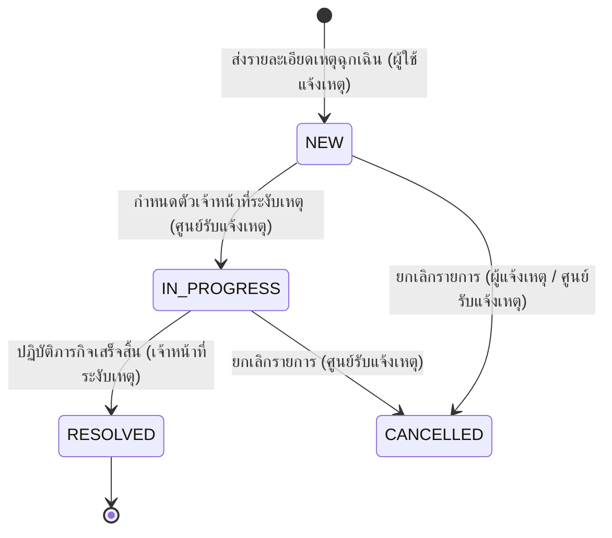

# SUT Campus Incident System — เอกสารวิเคราะห์สถาปัตยกรรมทางเทคนิคและคู่มือการตรวจประเมินระบบระบบแจ้งเหตุ

เอกสารฉบับนี้เป็นข้อกำหนดสถาปัตยกรรมและรายงานผลการตรวจสอบทางเทคนิคระดับสูงของระบบจัดการเหตุฉุกเฉินและแจ้งเหตุร้ายภายในมหาวิทยาลัย (**SUT Campus Incident System**) โดยผ่านการวิเคราะห์ซอร์สโค้ดในพื้นที่ทำงานหลัก `a:\mobile_user_app\mobile_user_app - สำเนา (3)` อย่างละเอียดถี่ถ้วน

---

## 1. บทสรุปผู้บริหาร (Executive Summary)

ระบบจัดการและแจ้งเหตุด่วนภายในมหาวิทยาลัยเทคโนโลยีสุรนารี (SUT Campus Incident System) เป็นโซลูชันระดับองค์กรที่ได้รับการออกแบบเป็นพิเศษเพื่อแก้ไขปัญหาความล่าช้าในกระบวนการแจ้งเหตุและการสั่งการของเจ้าหน้าที่ศูนย์รักษาความปลอดภัยแบบดั้งเดิม โดยการสร้างพื้นที่การสื่อสารเรียลไทม์ที่เชื่อมโยงผู้ใช้ 3 กลุ่มเข้าด้วยกัน:
1.  **นักศึกษาและบุคลากร (Users)**: แจ้งเหตุได้ในทันทีด้วยการระบุประเภทภัยแนบรูปภาพ และดึงพิกัดแผนที่ผ่านตัวรับสัญญาณ GPS ความแม่นยำสูง
2.  **ศูนย์วิทยุรับแจ้งเหตุ (Dispatchers)**: มีระบบวิเคราะห์ข้อมูลสองเลย์เอาต์ (Desktop/Mobile) ที่มาพร้อมแผนที่แสดงพิกัดแบบเรียลไทม์ ตารางแสดงภาระงานของผู้ตอบสนองเหตุ และตัวช่วยตัดสินใจจัดสรรคิวงาน
3.  **ทีมระงับเหตุและช่วยเหลือ (Responders)**: ได้แก่ ทีมแพทย์โรงพยาบาล มหาวิทยาลัยเทคโนโลยีสุรนารี, หน่วยกู้ภัย และเจ้าหน้าที่รักษาความปลอดภัย ซึ่งสามารถกดรับงาน นำทางด้วยพิกัดแผนที่ และสนทนาโดยตรงกับศูนย์รับแจ้งเหตุ

### นวัตกรรมเด่นทางเทคนิคในระบบ
*   **การแปลงแอปพลิเคชันข้ามแพลตฟอร์ม (Cross-Platform Map Isolation)**: ออกแบบสถาปัตยกรรมการแสดงผลแผนที่แบบยืดหยุ่น โดยดึงไลบรารี Google Maps SDK มาวาดผลบนมือถือ และแปลงมาเป็นระบบ Leaflet OpenStreetMap บนเบราว์เซอร์และคอมพิวเตอร์เดสก์ท็อปเพื่อลดต้นทุน API
*   **อัลกอริทึมการกระจายงานที่ไม่มีความหน่วง $O(1)$**: ใช้เทคโนโลยีการทำแผนที่ในหน่วยความจำชั่วคราว (In-Memory Active Cases Mapping) เพื่อตรวจวัดภาระงานสะสมของผู้ระงับเหตุแต่ละราย โดยหลีกเลี่ยงปัญหาการยิงคิวรี่ฐานข้อมูลซ้ำซ้อนในลูป (N+1 Query) ซึ่งช่วยประหยัดทรัพยากรฐานข้อมูลได้อย่างมีนัยสำคัญ
*   **ระบบยืนยันตัวตนและการเข้าถึงแบบเสมือน (virtual-email authentication)**: เชื่อมต่อบัญชีของมหาวิทยาลัยโดยผู้ใช้ล็อกอินด้วยรหัสนักศึกษาหรือบุคลากร ซึ่งระบบจะนำไปจัดโครงสร้างเป็นบัญชีอีเมลเสมือนภายใต้โดเมน `@campus.local` เพื่อใช้งานกับระบบ Firebase Auth โดยไม่ต้องผูกระบบอีเมลภายนอกที่ซับซ้อน

---

## 2. ภาพรวมของแอปพลิเคชัน (Application Overview)

การเปลี่ยนสถานะข้อมูลการแจ้งเหตุฉุกเฉินเปรียบเสมือนเครื่องจักรสถานะ (State Machine) ที่ถูกควบคุมอย่างเข้มงวดตลอดกระบวนการทำงาน:



### หน้าที่และฟังก์ชันการใช้งานของแต่ละฝ่าย
*   **ฝั่งนักศึกษา/บุคลากร (User Console)**: สามารถเข้าถึงฟอร์มส่งข้อมูลด่วนแยกประเภทภัย (ความมั่นคง, ทางแพทย์, อุบัติเหตุรถยนต์, อาคารสถานที่ชำรุด และบริการทั่วไป) ถ่ายภาพแนบเหตุสด ตรวจสอบจุดเกิดเหตุปัจจุบันผ่านพิกัดพิกเซล GPS และติดตามสถานะความคืบหน้าของเหตุการณ์
*   **ฝั่งผู้ประสานงานศูนย์รักษาความปลอดภัย (Dispatcher Console)**: มีแผงควบคุมกลางแสดงแผนที่รวม พิกัดของเหตุการณ์ และตำแหน่งล่าสุดของผู้ตอบสนองเหตุ พร้อมเครื่องมือจัดอันดับคะแนนผู้ปฏิบัติงาน (Responder Recommendation Board) เพื่อเลือกผู้ปฏิบัติการที่อยู่ใกล้และพร้อมที่สุดเข้าไประงับเหตุ
*   **ฝั่งเจ้าหน้าที่หน่วยงานเผชิญเหตุ (Responder Console)**: ออกแบบมาเพื่อการทำงานภาคสนาม โดยแสดงข้อมูลเหตุที่ได้รับมอบหมาย ทิศทางการระงับเหตุ พร้อมแถบสถานะการเดินทางอย่างยืดหยุ่น (`ACCEPTED` $\rightarrow$ `EN_ROUTE` $\rightarrow$ `ARRIVED` $\rightarrow$ `RESOLVED`) โดยในขณะรันภารกิจจะสามารถพิมพ์ข้อความหรืออัปโหลดภาพสดคุยประสานงานกับศูนย์วิทยุได้ตลอดเวลา

---

## 3. การวิเคราะห์โครงสร้างโฟลเดอร์โปรเจกต์ (Folder Structure Analysis)

แอปพลิเคชันไคลเอนต์หลักได้รับการออกแบบโครงสร้างตามแนวคิด **Clean Architecture** ผนวกกับสถาปัตยกรรมแบบแยกตามฟังก์ชันการใช้งาน (**Feature-First Layering**) เพื่อให้ง่ายต่อการขยายฟีเจอร์ใหม่โดยไม่รบกวนโมดูลเดิม:

```
lib/
├── main.dart                       # จุดเริ่มต้นรันแอปพลิเคชัน ติดตั้งอินสแตนซ์ Firebase การทำระบบรีโมตคอนฟิก และ AuthGate
├── core/                           # โค้ดส่วนกลาง คอนฟิกระบบ ตัวแปลงค่า (Helpers) และเซอร์วิสการจัดการข้ามระบบปฏิบัติการ
│   ├── adaptive_map_widget.dart    # โมดูลแผนที่ที่รวม API Google Maps (มือถือ) และ Leaflet (เว็บ) เข้าเป็นคลาสเดียว
│   ├── constants.dart              # ข้อมูลเซตคงที่ รายการประเภทเหตุความปลอดภัย โลโก้ และข้อความหลักของระบบ
│   ├── helpers.dart                # ฟังก์ชันคณิตศาสตร์คำนวณพิกัดภูมิศาสตร์ ตัวแปลงรูปแบบเวลา และตัวกรอง Regex ตัวอักษร
│   ├── providers.dart              # จุดประกาศ Riverpod สำหรับกระแสข้อมูล (Streams) และอินสแตนซ์ฐานข้อมูลส่วนกลาง
│   ├── session_timeout.dart        # แผงตรวจสอบการทำงานของผู้ใช้ (ข้ามการล้มเซสชันอัตโนมัติเพื่อคงหน้าจอมอนิเตอร์)
│   ├── theme.dart                  # การกำหนดฟอนต์ Outfit จานสีส้ม-แสดมหาวิทยาลัย (SUT Orange) และสไตล์ปุ่มนำทาง
│   ├── version_check.dart          # ฟังก์ชันเปรียบเทียบเลข Semver บนฐานข้อมูลเพื่อสั่งบังคับอัปเดตเวอร์ชันแอปพลิเคชัน
│   ├── web_notification.dart       # ประตูคัดกรองแพลตฟอร์มเพื่อเรียกใช้ระบบแจ้งเตือนแบบ JS Interop บนเบราว์เซอร์
│   ├── web_notification_impl.dart  # โค้ดเชื่อมต่อ JS Interop สำหรับสั่งสั่นอุปกรณ์ ดึง API เสียงเบราว์เซอร์ และแจ้งเตือนระบบ
│   └── web_notification_stub.dart  # ด่านดักการทำงานสำหรับอุปกรณ์ Android/iOS เพื่อป้องกันข้อผิดพลาดการคอมไพล์
├── models/                         # แบบจำลองโครงสร้างข้อมูลเพื่อนำเข้าและส่งออกจาก Firestore
│   ├── incident_model.dart         # แผนผังออบเจกต์ของเหตุฉุกเฉิน รายละเอียดผู้รับเคส แผนผังประวัติการทำงาน และการลงเวลาเปิดอ่าน
│   └── user_model.dart             # แผนผังออบเจกต์โปรไฟล์ผู้ใช้ บทบาทหน้าที่ สถิติการสะสมคะแนนจิตอาสา และข้อมูลพิกัดล่าสุด
└── features/                       # โฟลเดอร์แยกตามโมดูลทางธุรกิจของแอปพลิเคชัน
    ├── admin/                      # แดชบอร์ดผู้ดูแลระบบ เพิ่มประวัติผู้ระงับเหตุ และตารางตรวจสอบแต้มช่วยเหลือสังคม
    ├── announcement/               # ระบบข่าวด่วนประชาสัมพันธ์ ประกาศเตือนภัยล่วงหน้า และแอนิเมชันสไลด์การ์ดข่าว
    ├── auth/                       # โมดูลเข้าสู่ระบบ แปลงค่ารหัสผ่านเป็นโดเมนเสมือน และฟังก์ชันรีเซ็ตรหัสผ่านแบบสองขั้นตอน
    │   ├── data/auth_repository.dart
    │   └── presentation/login_screen.dart, register_screen.dart, role_redirect.dart
    ├── chat/                       # ห้องคุยสดจับเวลาตามเหตุการณ์ฉุกเฉิน และระบบส่งข้อความระบุคู่สนทนาแบบ DM
    │   ├── data/chat_repository.dart, direct_chat_repository.dart
    │   └── presentation/chat_screen.dart, direct_chat_screen.dart
    ├── dispatcher/                 # ระบบสั่งการศูนย์รับแจ้งเหตุ ตารางจัดการคะแนนแนะนำผู้ปฏิบัติการ และเซอร์วิสเล่นเสียงแจ้งภัย
    │   ├── dispatcher_screen.dart
    │   ├── sound_alert_service.dart
    │   └── responders_panel.dart, dispatcher_stats_widget.dart
    ├── home/                       # หน้าจอนักศึกษา ทางลัดกดแจ้งเหตุฉุกเฉิน และหน้าจอกรอกพิกัดระบุตำแหน่งภัยเงียบ
    ├── incident/                   # ตรรกะฝั่งการควบคุมสเตตความปลอดภัย อัลกอริทึมแนะนำเจ้าหน้าที่ F5 และพิกัดระงับเหตุ F6
    │   ├── data/incident_repository.dart
    │   └── domain/responder_logic.dart
    ├── notification/               # ระบบประมวลผลข้อความและรับไอดีอุปกรณ์ปลายทาง (FCM Client & Messaging Router)
    └── profile/                    # หน้าประวัติการทำงานผู้ใช้ การแก้ไขหมายเลขเบอร์โทรติดต่อ และตารางลีดเดอร์บอร์ดจิตอาสา
```

---

## 4. วิเคราะห์สถาปัตยกรรมทางเทคนิค (Architecture Analysis)

สถาปัตยกรรมหลักของระบบ SUT Campus Incident System ถูกยึดโยงด้วยกฎการแยกความรับผิดชอบอย่างชัดเจนตามมาตรฐานอุตสาหกรรม:

```
        ┌────────────────────────────────────────────────────────┐
        │                 ชั้นนำเสนอข้อมูล (PRESENTATION)         │
        │  (หน้าจอ UI, วิดเจ็ต, แผนผังแบบตอบสนอง, ตัวสลับเลย์เอาต์)    │
        └───────────────────────────┬────────────────────────────┘
                                    │ คอยสังเกตการณ์ (Watches)
                                    ▼
        ┌────────────────────────────────────────────────────────┐
        │                  ชั้นตรรกะระบบ (DOMAIN)                │
        │      (กฎความถูกต้องทางธุรกิจ, กฎการเปลี่ยนสถานะเหตุการณ์)     │
        └───────────────────────────┬────────────────────────────┘
                                    │ สั่งทำงาน (Invokes)
                                    ▼
        ┌────────────────────────────────────────────────────────┐
        │                  ชั้นจัดการข้อมูล (DATA)                 │
        │  (ตัวประสาน Firebase API, เซอร์วิสไอโซเลต, ออบเจกต์สัญญา) │
        └────────────────────────────────────────────────────────┘
```

*   **Presentation Layer (ชั้นนำเสนอข้อมูล)**: โค้ดในกลุ่มนี้ได้รับการพัฒนาแบบปฏิกิริยา (Reactive) โดยคอยสังเกตการณ์การเปลี่ยนแปลงค่าสเตตจาก Riverpod Providers ทำให้ไม่มีการเขียนคำสั่งเปลี่ยนข้อมูลค้างในระดับวิเจ็ต
*   **Domain Layer (ชั้นตรรกะระบบ)**: โครงสร้างตรรกะความปลอดภัยจะถูกเก็บในไฟล์ประเภท `responder_logic.dart` ซึ่งทำหน้าที่เป็นรั้วกั้นทางธุรกิจ ป้องกันการเปลี่ยนสถานะเหตุการณ์ที่ข้ามขั้นตอนที่ถูกต้อง
*   **Data Layer (ชั้นจัดการข้อมูล)**: เก็บอยู่ในรูปแบบของคลาสผู้ส่งออกข้อมูลอย่างครอบคลุม (`AuthRepository`, `IncidentRepository`, `ChatRepository`, `DirectChatRepository`) เพื่อทำหน้าที่แมปและจัดระเบียบ JSON เอกสารเชื่อมต่อกับฐานข้อมูล Cloud Firestore

---

## 5. การวิเคราะห์ไลบรารีและการใช้งาน (Dependency Analysis)

ไลบรารีและแพ็กเกจภายนอกทั้งหมดที่ระบบเรียกใช้ได้รับการตรวจสอบและประกาศในไฟล์ [pubspec.yaml](file:///a:/mobile_user_app/mobile_user_app%20-%20%E0%B8%AA%E0%B8%B3%E0%B9%80%E0%B8%99%E0%B8%B2%20%283%29/pubspec.yaml) ดังตารางวิเคราะห์การใช้งานเชิงลึกต่อไปนี้:

```yaml
dependencies:
  flutter:
    sdk: flutter
  flutter_riverpod: ^2.3.6          # ใช้ในการฉีดพึ่งพาภายนอก (Dependency Injection) และคอยรับสายข้อมูลใน providers.dart
  firebase_core: ^2.15.0            # ติดตั้งและจัดเก็บตัวแปรตั้งค่าสิทธิ์ฐานข้อมูลใน main.dart
  firebase_auth: ^4.7.0             # รองรับการเข้ารหัสบัญชีเสมือนและการจัดส่งประวัติล็อกอินของผู้ใช้ใน auth_repository.dart
  cloud_firestore: ^4.8.0           # จัดการกระแสข้อมูลเหตุและแชทแบบ Real-time ดึง Snapshot ข้อมูลใน incident_repository.dart
  firebase_storage: ^11.2.4         # โอนย้ายและจัดเก็บบัญชีไฟล์ภาพถ่ายระบุเหตุฉุกเฉินขึ้นคลาวด์บนโฟลเดอร์ /incident_images
  firebase_messaging: ^14.6.4       # รันไอดีรับส่งข้อความแจ้งเตือนระยะไกลบนเบลอแอปใน notification_service.dart
  cloud_functions: ^4.3.4           # เรียกใช้งานคลาวด์ฟังก์ชันของ Firebase จากระยะไกลในคลาส auth_repository.dart
  google_maps_flutter: ^2.4.0       # แสดงแผงควบคุมแผนที่ระดับพิกเซลและความเร็วสูงบนมือถือ (adaptive_map_widget.dart)
  flutter_map: ^6.0.0               # แสดงแผนที่ Leaflet และวาดโมเดลรูปพิกัดบนเว็บเบราว์เซอร์ผ่านพอร์ต OpenStreetMap
  latlong2: ^0.9.0                  # กำหนดชนิดข้อมูลพิกัดลองจิจูดและละติจูดของ Leaflet
  geolocator: ^10.0.1               # ตรวจสอบสิทธิ์การเข้าถึงอุปกรณ์ดาวเทียมและดึงพิกัดภูมิศาสตร์ล่าปัจจุบัน
  flutter_local_notifications: ^15.1.0+1 # บูตระบบป็อปอัพหน้าต่างแจ้งเตือนแถบงานบนแท็บเล็ตและอุปกรณ์โทรศัพท์
  audioplayers: ^5.2.1              # เล่นเสียงเตือนภัยจากโฟลเดอร์สินทรัพย์ภายนอกบนโมเดลแอปพลิเคชันดั้งเดิม
  package_info_plus: ^4.0.2         # ตรวจสอบเลข Semver ของแอปพลิเคชันเวอร์ชันเครื่องเทียบฐานข้อมูลกลาง
  introduction_screen: ^3.1.1       # ออกแบบการสไลด์แนะนำแอปพลิเคชันเบื้องหลังแก่ผู้ใช้เมื่อดาวน์โหลดครั้งแรก
  fl_chart: ^0.63.0                 # ออกแบบและวาดกราฟสถิติคดีเหตุสะสมภายในขอบเขตมหาวิทยาลัยบนศูนย์สั่งการ
```

---

## 6. วิเคราะห์การนำเข้าและสัญญาระบบ (Import Analysis)

สถาปัตยกรรมนำเข้าไฟล์ของ SUT Campus Incident System ถูกออกแบบให้ป้องกันปัญหาวงจรรวมวนซ้ำ (Cyclic Dependencies) ที่อาจก่อให้เกิดจุดบกพร่องระหว่างรันแอปพลิเคชัน:

```
                  ┌──────────────────────┐
                  │      main.dart       │
                  └──────────┬───────────┘
                             │
                             ▼
               ┌───────────────────────────┐
               │    core/providers.dart    │
               └─────────────┬─────────────┘
                             │
            ┌────────────────┴────────────────┐
            ▼                                 ▼
┌────────────────────────┐        ┌────────────────────────┐
│  auth_repository.dart  │        │ incident_repository.dart│
└────────────────────────┘        └────────────────────────┘
            │                                 │
            ▼                                 ▼
┌────────────────────────┐        ┌────────────────────────┐
│   user_model.dart      │        │  incident_model.dart   │
└────────────────────────┘        └────────────────────────┘
```

*   **สัญญาสารบัญตัวแปรศูนย์กลาง**: [providers.dart](file:///a:/mobile_user_app/mobile_user_app%20-%20%E0%B8%AA%E0%B8%B3%E0%B9%80%E0%B8%99%E0%B8%B2%20%283%29/lib/core/providers.dart) ทำหน้าที่จัดเก็บและส่งออกอินสแตนซ์ต่าง ๆ ช่วยลดปัญหาการเข้าถึงฐานข้อมูลซ้ำซ้อน
*   **การเชื่อมโยงระบบแจ้งเตือนแบบไร้การผูกมัด (Decoupled Routing)**: ปลั๊กอินแจ้งเตือนระยะไกลจะถูกเชื่อมต่อโดยแยกโมเดลการนำทางผ่าน [notification_router.dart](file:///a:/mobile_user_app/mobile_user_app%20-%20%E0%B8%AA%E0%B8%B3%E0%B9%80%E0%B8%99%E0%B8%B2%20%283%29/lib/features/notification/notification_router.dart) ทำให้ไม่มีความเกี่ยวพันทางตรงกับสเตตรีดเดอร์หน้าจอความคุ้มครอง

---

## 7. ข้อมูลเจาะลึกฟีเจอร์การแจ้งเหตุ (Features Analysis)

### F1: ระบบรายงานเหตุฉุกเฉินความเร็วสูง (Incident Reporting)
นักศึกษาผู้ประสบภัยสามารถแจ้งความเดือดร้อนผ่านกริดประเภทภัย ดึงข้อมูลพิกัดความละเอียดระดับละติจูดและลองจิจูดจากดาวเทียมด้วยความคลาดเคลื่อนไม่เกิน 10 เมตร โดยเรียกใช้คลาส `Geolocator` อัปโหลดไฟล์ภาพสดผ่านการจัดการเธรดแบบอะซิงโครนัสไปที่จัดเก็บ Firebase Storage จากนั้นจึงบันทึกข้อมูลทั้งหมดลงฐานข้อมูล Firestore `/incidents` ในทันที

### F2: โหมดเข้าสู่ระบบแบบบัญชีมหาวิทยาลัยเสมือน (virtual GSuite Credentials)
พัฒนาฟังก์ชันดักแปลงบัญชีผู้ใช้เมื่อล็อกอินด้วยรหัสนักศึกษาหรือบุคลากรของมหาวิทยาลัยเทคโนโลยีสุรนารี (เช่น `B1234567`) โดยระบบหลังบ้าน `AuthRepository` จะทำการแปลงรหัสดังกล่าวให้เป็นตัวพิมพ์ใหญ่อัตโนมัติและต่อท้ายด้วยโดเมน `@campus.local` เพื่อป้อนเข้าสู่ระบบ Firebase Auth `signInWithEmailAndPassword` ซึ่งวิธีนี้ช่วยเพิ่มความปลอดภัยในการยืนยันตัวตนโดยใช้รหัสประจำตัวของมหาวิทยาลัย

### F3: ระบบกู้คืนบัญชีผู้ใช้งานผ่านโทรศัพท์แบบสองขั้นตอน (Password Recovery)
กู้คืนบัญชีผู้ใช้ผ่านระบบโทรศัพท์โดยตรง ไม่ต้องกังวลเรื่องการรับส่งอีเมลหรือ OTP:
*   **ขั้นตอนแรก (ยืนยันสิทธิ์ตัวตน)**: ป้อนข้อมูลรหัสประจำตัวและหมายเลขโทรศัพท์ผ่านระบบ Cloud Function เพื่อตรวจสอบความสอดคล้องกับระเบียนประวัติที่มีในฐานข้อมูลกลาง
*   **ขั้นตอนที่สอง (ปรับปรุงรหัสผ่านใหม่)**: หากข้อมูลถูกต้อง แอปพลิเคชันจะส่งคำขอไปยังระบบ Cloud Function เพื่อเข้าถึง API `firebase-admin` ของระบบรักษาความปลอดภัยหลังบ้าน เพื่อแก้ไขรหัสผ่านใหม่ของผู้ใช้โดยตรง

### F4: สเตตจัดการข้อมูลสตรีมเรียลไทม์ (Reactive UI Stream Engine)
ใช้ประโยชน์จากการทำงานร่วมกันระหว่าง Riverpod และ Firestore Snapshots (`currentUserProvider`, `authStateProvider`) เพื่อให้ UI ปรับปรุงการแสดงผลโดยอัตโนมัติเมื่อเกิดการอัปเดตข้อมูลใด ๆ ในฝั่งหลังบ้าน เช่น เมื่อเจ้าหน้าที่ระงับเหตุอัปเดตค่าพิกัดการเดินทาง หรือนักศึกษาได้รับแต้มคะแนนจิตอาสาเพิ่ม

### F5: ระบบวิเคราะห์และคะแนนผู้ระงับเหตุที่เหมาะสม (Suggestion Scoring Panel)
หน้าจอวิเคราะห์งานอัจฉริยะสำหรับศูนย์วิทยุ ซึ่งจะเรียงอันดับความเหมาะสมของผู้ปฏิบัติงาน (Responders) แบบเรียลไทม์ โดยประเมินจากหลักเกณฑ์ 3 ประการ:
1.  **ความสอดคล้องของแผนก (+3 คะแนน)**: ระบบจะจับคู่ความเชี่ยวชาญของหน่วยงานกับประเภทเหตุการณ์ เช่น ส่งทีมแพทย์ (hospital) เมื่อเกิดเหตุเจ็บป่วย (medical)
2.  **การควบคุมภาระงานสะสม (+2 คะแนน)**: มอบคะแนนพิเศษให้แก่ผู้ปฏิบัติงานที่มีงานคงค้างอยู่ในมือไม่ถึง 2 เคส
3.  **ระยะทางเข้าถึงพิกัด (+1 คะแนน)**: คำนวณระยะทางแบบเส้นโค้งของผิวโลกด้วยสูตร Haversine หากพิกัดปัจจุบันของผู้ระงับเหตุห่างจากจุดเกิดเหตุไม่เกิน 1.0 กิโลเมตร

### F6: สตรีมพิกัดเคลื่อนย้ายระงับเหตุเรียลไทม์ (Live Responder GPS Tracking)
เจ้าหน้าที่ระงับเหตุที่อยู่ระหว่างเดินทางจะส่งค่าพิกัดภูมิศาสตร์กลับมายังคอลเลกชัน `users/{uid}/lastLocation` ในลักษณะเบื้องหลัง (Background Task) ซึ่งข้อมูลนี้จะถูกส่งต่อไปยังศูนย์รับแจ้งเหตุผ่านช่องทาง `getRespondersLocationStream()` เพื่อใช้ในการมอนิเตอร์เจ้าหน้าที่บนหน้าจอแผนที่ของห้องปฏิบัติการ

### F7: ช่องทางการสื่อสารแยกวัตถุประสงค์ (Incident Chats & DMs)
*   **ห้องสนทนารายเหตุฉุกเฉิน (Incident Chats)**: ระบบจะสร้างพื้นที่แชทกลุ่มขึ้นตามแผนผังห้องเกิดเหตุที่ฐานข้อมูล `/incidents/{incidentId}/messages` เพื่อให้ผู้ประสบภัย เจ้าหน้าที่ และผู้สั่งการสื่อสารร่วมกัน
*   **ระบบส่งข้อความระบุบุคคล (Direct Messages)**: ใช้สำหรับส่งข้อความระหว่างผู้สั่งการและเจ้าหน้าที่ที่คอลเลกชัน `/direct_messages/{chatId}/messages`

### F8: ระบบขจัดเสียงแจ้งเตือนซ้ำซ้อนแบบอัจฉริยะ (Double-Notification Suppression)
ป้องกันปัญหาเสียงแจ้งเตือนทำงานซ้ำซ้อนเมื่อผู้ใช้งานอยู่ในหน้าจอห้องสนทนานั้นอยู่แล้ว โดยระบบจะเก็บค่าสถานะ ID ห้องที่เปิดอยู่ไว้ในโครงสร้างการทำงานกลาง `WebNotificationWatcher` (`activeIncidentChatId`, `activeDmChatId`) เมื่อมีเอกสารแชทส่งเข้ามา ระบบจะข้ามขั้นตอนการเปิดหน้าต่างป๊อปอัปและเสียงแจ้งเตือนชั่วคราว เพื่อสร้างประสบการณ์การใช้งานที่ลื่นไหล

### F9: ระบบยืดหยุ่นหน้าต่างรับส่งข้อมูลข้ามมิติหน้าจอ (Responsive Dual-Layout Core)
ใช้ประโยชน์จากกลไกวิเคราะห์กรอบการแสดงผล `LayoutBuilder` ของ Flutter เพื่อปรับพอร์ตการแสดงผลให้เหมาะสมกับอุปกรณ์ที่รันโดยอัตโนมัติ:
*   **ขนาดจอเล็กบนมือถือ (< 700px)**: จัดเรียงเครื่องมือการทำงานในรูปแบบแถบแท็บด้านล่างที่สามารถใช้นิ้วปัดเลื่อนเพื่อสลับหน้าต่างได้อย่างรวดเร็ว
*   **ขนาดจอเดสก์ท็อปและเว็บบอร์ดหน้าจอศูนย์รับแจ้งเหตุ**: แสดงข้อมูลแบบหลายแผงหน้าต่างขนานกัน (Multi-Pane Split Screen) เพื่อให้เจ้าหน้าที่สามารถควบคุมเหตุฉุกเฉินและติดตามตำแหน่งของทีมผ่านแผนที่ได้พร้อมกัน

### F10: ระบบท่อส่งสัญญาณเสียงแยกส่วนการประมวลผล (Sound Alert Pipelines)
*   **ในอุปกรณ์ดั้งเดิม (Native App)**: ระบบจะขับเสียงไซเรนเตือนภัยจากโฟลเดอร์สินทรัพย์ภายในตัวเครื่องโดยใช้แพ็กเกจ `audioplayers`
*   **เมื่อเปิดเบราว์เซอร์ Web**: ระบบจะเปลี่ยนไปดักจับและส่งสัญญาณแจ้งเตือนโดยใช้ Web Audio API เพื่อเล่นเสียงสัญญาณผ่านบราวเซอร์ได้อย่างถูกต้อง

---

## 8. การวิเคราะห์ระดับฟังก์ชันและประสิทธิภาพ (Function-Level Analysis)

จากการตรวจสอบซอร์สโค้ดใน [incident_repository.dart](file:///a:/mobile_user_app/mobile_user_app%20-%20%E0%B8%AA%E0%B8%B3%E0%B9%80%E0%B8%99%E0%B8%B2%20%283%29/lib/features/incident/data/incident_repository.dart) และ [auth_repository.dart](file:///a:/mobile_user_app/mobile_user_app%20-%20%E0%B8%AA%E0%B8%B3%E0%B9%80%E0%B8%99%E0%B8%B2%20%283%29/lib/features/auth/data/auth_repository.dart) ฟังก์ชันหลักได้รับการออกแบบโดยคำนึงถึงประสิทธิภาพและความปลอดภัยสูงสุด ดังนี้:

### เมธอด `submitIncident(...)`
ใช้สำหรับรับรองประวัติเอกสารเกิดเหตุด่วนความมั่นคง อัปโหลดภาพ และกระจายพิกัด
*   **ตัวรับข้อมูลนำเข้า (Inputs)**: `title`, `description`, `latitude`, `longitude`, `priority`, `type`, `imageFiles` (ชุดข้อมูลไฟล์ภาพ)
*   **ขั้นตอนประมวลผล**: 
    1.  โอนไฟล์ภาพไปยังพาธ `/incident_images/{id}_{filename}` บน Firebase Storage แบบอะซิงโครนัสเพื่อดึง URL ที่สามารถเข้าถึงได้ผ่านอินเทอร์เน็ตกลับมาใช้งาน
    2.  สร้างโครงสร้างเอกสารใหม่ขึ้นภายใต้ root `/incidents` โดยกำหนดสเตตเริ่มต้นคือ `NEW`
    3.  ส่งสัญญาณข้อมูลไปยัง `NotificationService.sendPushNotification` เพื่อส่งการแจ้งเตือนไปยังกลุ่มเจ้าหน้าที่วิทยุรับแจ้งเหตุ

### เมธอด `updateIncidentStatus(...)`
ควบคุมขั้นตอนการเปลี่ยนสถานะของเหตุการณ์ เพื่อป้องกันข้อผิดพลาดในการเปลี่ยนระดับความปลอดภัย
*   **การเชื่อมโยงกฎระบบ (Domain Checking)**: ตรวจสอบคำขอกับตรรกะในคลาส `responder_logic.dart` ก่อนแก้ไขฐานข้อมูลเสมอ
*   **การอัปเดตแบบ Transaction (Atomicity)**:
    ```dart
    final docRef = _firestore.collection('incidents').doc(incidentId);
    await _firestore.runTransaction((transaction) async {
      final snapshot = await transaction.get(docRef);
      // ตรวจสอบความถูกต้องและปรับปรุงฟิลด์สถานะพร้อมกันในทรานเซกชันเดียว
    });
    ```
    การประมวลผลธุรกรรมฐานข้อมูลร่วมกันในขั้นตอนเดียวนี้ ช่วยป้องกันปัญหาการเขียนข้อมูลซ้อนทับกันเมื่อเจ้าหน้าที่แก้ไขข้อมูลพร้อมกัน

### เมธอด `getRespondersWithStats(...)`
ประมวลผลตารางคะแนนแนะนำผู้ปฏิบัติการอย่างมีประสิทธิภาพ ป้องกันความล่าช้าในการดึงข้อมูลจากระบบภายนอก
*   **กลไกแก้ไขปัญหาคิวรี่ N+1 (N+1 Query Resolution)**:
    แทนที่จะสั่งคิวรี่ฐานข้อมูลหาจำนวนเคสของพนักงานแต่ละคนทีละรายจนครบ ฟังก์ชันนี้ได้รับการออกแบบใหม่โดยดึงข้อมูลเหตุที่ยังไม่เสร็จสิ้น (`IN_PROGRESS`) ทั้งหมดของระบบขึ้นมาในคำสั่งเดียว:
    ```dart
    final activeIncidentsSnap = await _firestore.collection('incidents')
        .where('status', isEqualTo: 'IN_PROGRESS').get();
    ```
    จากนั้นระบบจะนำข้อมูลดังกล่าวไปประมวลผลและสร้างแผนผังภาระงานสะสม (`activeCasesMap`) ในหน่วยความจำชั่วคราว ทำให้สามารถเปรียบเทียบภาระงานของพนักงานได้ในความเร็วคงที่ $O(1)$ โดยไม่ต้องส่งคำร้องขอข้อมูลไปยังเซิร์ฟเวอร์ฐานข้อมูลซ้ำ ๆ

---

## 9. การวิเคราะห์ระบบคลาวด์หลังบ้าน (Firebase / Backend Analysis)

```
                              ┌──────────────────────┐
                              │ Firebase Auth        │
                              │ (ยืนยันตัวตนผู้ใช้)     │
                              └──────────┬───────────┘
                                         │
                   ┌─────────────────────┼─────────────────────┐
                   ▼                     ▼                     ▼
        ┌──────────────────┐  ┌──────────────────┐  ┌──────────────────┐
        │ Cloud Firestore  │  │ Cloud Storage    │  │ Cloud Functions  │
        │ (ฐานข้อมูลเรียลไทม์) │  │ (ที่จัดเก็บไฟล์แนบ) │  │ (สิงคโปร์ - SG)   │
        └──────────────────┘  └──────────────────┘  └──────────────────┘
```

*   **Firebase Authentication**: รองรับการตรวจสอบประวัติบัญชีผู้ใช้ บัญชีอีเมลเสมือน และการบริหารสิทธิ์ของเครื่องไคลเอนต์
*   **Cloud Storage**: ตรวจสอบการจัดเก็บไฟล์แนบสดของพิกัดเกิดเหตุ โดยกำหนดกฎการบันทึกเอกสารให้รองรับเฉพาะไฟล์รูปภาพ (`image/*`) และจำกัดขนาดไม่เกิน $10\text{ MB}$ ต่อรายการ
*   **Cloud Firestore**: จัดการฐานข้อมูล NoSQL โดยกำหนดเงื่อนไขปิดการใช้แคชออฟไลน์บนสภาพแวดล้อมระบบเว็บเบราว์เซอร์ เพื่อหลีกเลี่ยงเหตุการณ์ฐานข้อมูลเกิดการล็อกชั่วคราวจากการเลื่อนของเวลาที่ไม่ตรงกับเครื่องเซิร์ฟเวอร์
*   **คลาวด์ฟังก์ชันของ Firebase ในสิงคโปร์ (Singapore Region - `asia-southeast1`)**: 
    ตัวเลือกโครงสร้างนี้จำเป็นต้องเลือกติดตั้งระบบคลาวด์ที่ภูมิภาค **สิงคโปร์ (Singapore - `asia-southeast1`)** เนื่องจากฟังก์ชันประเภทตอบสนองเหตุการณ์ต่อฐานข้อมูล (Firestore reactive triggers) ยังไม่เปิดให้ใช้บริการในเขตกรุงเทพฯ (`asia-southeast3`) โครงสร้างระบบ Node.js ประกอบด้วย 3 บริการสำคัญ:
    1.  `sendPushNotification`: รับรองการส่งข้อมูลแจ้งเตือนไปยังไอคอนเตือนภัยระดับระบบ
    2.  `verifyStudentByPhone`: ทำหน้าที่เปรียบเทียบตัวเลขเบอร์โทรและรหัสของนักศึกษา
    3.  `resetPasswordByPhone`: ทำหน้าที่เปลี่ยนผ่านรหัสเข้ารหัสผ่านใหม่ในระดับแอดมินโดยตรง

---

## 10. โครงสร้างและการจัดระเบียบข้อมูล (Database Schema Layout)

รายละเอียดการออกแบบและจัดเก็บข้อมูลบนฐานข้อมูล NoSQL Cloud Firestore แบ่งออกเป็น 3 คอลเลกชันหลัก:

### คอลเลกชันหลัก: `users`
*   พาธฐานข้อมูล: `/users/{uid}`
*   โครงสร้างข้อมูล:
    ```json
    {
      "uid": "String (ไอดีประจำตัวผู้ใช้)",
      "studentId": "String (รหัสนักศึกษา/บุคลากร)",
      "email": "String (อีเมลเสมือนที่แอปสร้างขึ้น)",
      "firstName": "String",
      "lastName": "String",
      "phone": "String (เบอร์โทรสำหรับใช้กู้คืนบัญชี)",
      "role": "String (user | responder | dispatcher | admin)",
      "department": "String (hospital | rescue | security | null)",
      "volunteerPoints": "Integer (คะแนนจิตอาสาสะสม)",
      "lastLocation": {
        "lat": "Double (ละติจูด)",
        "lng": "Double (ลองจิจูด)",
        "updatedAt": "Timestamp"
      },
      "fcmToken": "String (ไอดีอุปกรณ์สำหรับการแจ้งเตือน)",
      "createdAt": "Timestamp"
    }
    ```

### คอลเลกชันหลัก: `incidents`
*   พาธฐานข้อมูล: `/incidents/{incidentId}`
*   โครงสร้างข้อมูล:
    ```json
    {
      "title": "String (หัวข้อการแจ้งเหตุ)",
      "description": "String (รายละเอียดเหตุร้าย)",
      "type": "String (security | medical | accident | facility | assistance)",
      "priority": "String (LOW | MEDIUM | HIGH | URGENT)",
      "status": "String (NEW | IN_PROGRESS | RESOLVED | CANCELLED)",
      "timelineStatus": "String (REPORTED | ACCEPTED | EN_ROUTE | ARRIVED | RESOLVED)",
      "reporterId": "String (ไอดีผู้แจ้งเหตุ)",
      "reporterName": "String",
      "reporterPhone": "String",
      "responderId": "String (ไอดีเจ้าหน้าที่ผู้ระงับเหตุ)",
      "responderName": "String (null)",
      "latitude": "Double (พิกัดพิกเซลเกิดภัย ละติจูด)",
      "longitude": "Double (พิกัดพิกเซลเกิดภัย ลองจิจูด)",
      "imageUrls": "Array of Strings (รายการภาพแนบเกิดเหตุ)",
      "createdAt": "Timestamp",
      "updatedAt": "Timestamp",
      "lastMessageAt": "Timestamp (null)",
      "lastMessageSenderId": "String (null)",
      "lastReadBy": {
        "{uid}": "Timestamp (บันทึกประวัติการเปิดอ่านแชท)"
      }
    }
    ```

#### คอลเลกชันย่อย (Subcollection): `messages` (ซ้อนอยู่ภายใต้เอกสารเกิดเหตุ)
*   พาธฐานข้อมูล: `/incidents/{incidentId}/messages/{messageId}`
*   โครงสร้างข้อมูล:
    ```json
    {
      "senderId": "String (ไอดีผู้ส่งข้อความ)",
      "senderName": "String",
      "text": "String (ข้อความข้อสนทนา)",
      "imageUrl": "String (ทางลัดไฟล์ภาพอธิบายเหตุ)",
      "createdAt": "Timestamp"
    }
    ```

### คอลเลกชันหลัก: `direct_messages`
*   พาธฐานข้อมูล: `/direct_messages/{chatId}` (การสร้างไอดีแชทจะมาจากการเรียงตามลำดับตัวอักษร: `dm_{sortedUid1}_{sortedUid2}`)
*   โครงสร้างข้อมูล:
    ```json
    {
      "participants": "Array of Strings [ไอดีผู้รับ, ไอดีผู้ส่ง]",
      "lastMessageAt": "Timestamp",
      "lastMessageText": "String",
      "lastMessage": "String (ฟิลด์ข้อความคงค้างเพื่อป้องกันข้อผิดพลาดการดึงข้อมูลต่างคีย์)",
      "lastMessageSenderId": "String",
      "updatedAt": "Timestamp",
      "lastReadBy": {
        "{uid}": "Timestamp"
      }
    }
    ```

#### คอลเลกชันย่อย (Subcollection): `messages` (ซ้อนอยู่ภายใต้เอกสารสนทนาส่วนตัว)
*   พาธฐานข้อมูล: `/direct_messages/{chatId}/messages/{messageId}`
*   โครงสร้างข้อมูล:
    ```json
    {
      "senderId": "String (ไอดีผู้ส่ง)",
      "senderName": "String",
      "text": "String (ข้อความแชท)",
      "imageUrl": "String (ภาพแนบเสริม)",
      "createdAt": "Timestamp"
    }
    ```

---

## 11. ภาพรวมและเส้นทางสัญญาณการแจ้งเตือน (Notification Flow)

การจัดส่งข่าวสารแจ้งเหตุร้ายและข้อความระบบทำงานประสานสอดคล้องข้ามทุกแพลตฟอร์มอย่างลื่นไหล:

```
[จุดสั่งยิงเหตุการณ์] (เช่น ข้อความห้องแชทใหม่ / การเปลี่ยนสถานะความปลอดภัย)
      │
      ▼
[สร้างฟอร์มข้อความ FCM Payload]
      │
      ▼
[ช่องรับส่งสัญญาณ FCM Gateway] ───► อุปกรณ์มือถือ ───► คัดกรองและสั่นอุปกรณ์พร้อมไซเรนไซเรน
      │
      ▼
  แอนิเมชันเว็บ Watcher ────────► สัญญาณ Firestore ──► ปลุกเบราว์เซอร์และแสดงแบนเนอร์แจ้งเตือน PWA
```

1.  **ช่องสัญญาณความสำคัญสูง (Notification Channels)**:
    *   `urgent_incidents_v2`: ช่องส่งข้อมูลเตือนภัยระดับเร่งด่วนที่สุด โทรศัพท์จะสั่นสะเทือนหนักพร้อมเปิดเสียงไซเรนฉุกเฉิน
    *   `chat_messages`: ช่องข้อมูลข่าวสารการประสานงาน เครื่องจะดังสตรีมสั้นเพื่อไม่ให้รบกวนผู้ระงับภัย
    *   `status_updates`: ช่องทางเปลี่ยนผ่านข้อมูลประวัติความคืบหน้า ซึ่งแอปพลิเคชันจะรันแบบปิดเสียง
2.  **การป้องกันเสียงรบกวนตนเอง**:
    เมธอดส่งสารจะเปรียบเทียบ UID ผู้กระตุ้นระบบ หากไอดีของผู้ส่งข้อความตรงกับรหัสตรวจสอบ อุปกรณ์เครื่องฝั่งนั้นจะปิดกั้นคำขอแสดงแจ้งเตือน เพื่อไม่ให้เครื่องของผู้ส่งเกิดอาการสั่นสะเทือนซ้ำกับสติ๊กเกอร์ที่ตนส่ง

---

## 12. ระบบภูมิศาสตร์และแผนที่สั่งการ (Location / GPS System)

การเก็บพิกัดเชิงกายภาพและการประมวลระยะห่างของผู้เผชิญภัย:

```
[ตัวจับสัญญาณ geolocator (GPS)] ──► ประมวลค่าลองจิจูดและละติจูด ──► อัปเดตลงเอกสารแจ้งเหตุ
                                                                            │
                                                                            ▼
[อัลกอริทึมสูตรระยะห่าง Haversine] ◄── อ่านค่าพิกัดผู้ระงับเหตุ ◄── [คอลเลกชัน /users ของระบบ]
```

*   **กำหนดสัญญารับสัญญาณดาวเทียม**: ปรับแต่งตัวแปรแบบความเที่ยงตรงสูง `LocationAccuracy.high` และจำกัดขอบความหน่วงรอบตัว `distanceFilter` ที่ระยะขั้นต่ำ 10 เมตร เพื่อป้องกันปัญหาข้อมูลแกว่งตัวเมื่ออยู่ในพื้นที่อับสัญญาณ
*   **ตัวคำนวณทางภูมิศาสตร์ (สูตรคณิตศาสตร์ Haversine)**:
    $$\Delta\phi = \phi_2 - \phi_1$$
    $$\Delta\lambda = \lambda_2 - \lambda_1$$
    $$a = \sin^2\left(\frac{\Delta\phi}{2}\right) + \cos(\phi_1)\cos(\phi_2)\sin^2\left(\frac{\Delta\lambda}{2}\right)$$
    $$c = 2\operatorname{atan2}\left(\sqrt{a}, \sqrt{1-a}\right)$$
    $$d = R \cdot c$$
    สูตรคณิตศาสตร์นี้มีความสำคัญอย่างยิ่งในการจัดอันดับรายชื่อเจ้าหน้าที่ระงับเหตุที่มีความเหมาะสมสูงสุดในการจัดส่งภารกิจ โดยการคำนวณระยะห่างระหว่างจุดเกิดเหตุและพิกัดล่าสุดของผู้ปฏิบัติการ

---

## 13. การบริหารสถานะกลางผ่านระบบ Riverpod (State Management Analysis)

แอปพลิเคชันใช้ไลบรารี **Riverpod** เพื่อทำหน้าที่เป็นสถาปัตยกรรมการส่งต่อข้อมูลส่วนกลางและการอ้างอิงออบเจกต์ ซึ่งทั้งหมดถูกประกาศใน [providers.dart](file:///a:/mobile_user_app/mobile_user_app%20-%20%E0%B8%AA%E0%B8%B3%E0%B9%80%E0%B8%99%E0%B8%B2%20%283%29/lib/core/providers.dart):

```
                              ┌──────────────────────┐
                              │ อินสแตนซ์ Firebase    │
                              │ (Firestore / Auth)   │
                              └──────────┬───────────┘
                                         │
                   ┌─────────────────────┴─────────────────────┐
                   ▼                                           ▼
       ┌────────────────────────┐                  ┌────────────────────────┐
       │ authStateProvider      │                  │ currentUserProvider    │
       │ (ติดตามกระแสล็อกอินเข้าออก)│                  │ (ติดตามเอกสารข้อมูลผู้ใช้)│
       └────────────────────────┘                  └────────────────────────┘
```

*   **`authStateProvider`**: คอยตรวจสอบและรายงานสถานะการเข้าสู่ระบบผ่านเซสชันของ Firebase Authentication เพื่อตรวจสอบความถูกต้องของสิทธิ์เมื่อผู้ใช้งานปิดและเปิดแอปพลิเคชันขึ้นมาใหม่
*   **`currentUserProvider`**: คอยรับและส่งต่อกระแสข้อมูล (StreamProvider) จากคอลเลกชัน `/users/{uid}` ของเอกสารโปรไฟล์ ซึ่งการทำงานนี้จะช่วยส่งสัญญาณอัปเดตข้อมูลระดับวินาทีไปยังหน้านำทางและหน้าข้อมูลผู้ใช้งาน
*   **`incidentRepositoryProvider`**: ให้บริการเข้าถึงคลาสการอ่านเขียนข้อมูลบน Firestore เพื่อให้สามารถสลับหรือทดสอบระบบการเขียนเอกสารจำลอง (Mocking) ได้อย่างมีประสิทธิภาพ

---

## 14. เส้นทางการทำงานในภาวะจริง (Runtime Flow Walkthrough)

ตัวอย่างเหตุการณ์สมมติเมื่อมีเหตุด่วนความมั่นคง และขั้นตอนตอบสนองของระบบตั้งแต่ต้นจนจบ:

### ขั้นตอนที่ 1: การล็อกอินและคัดกรอง
นักศึกษาผู้ลงทะเบียนเข้าใช้งานแอปผ่านรหัสประจำตัว (เช่น `B1234567`) โค้ดส่วนควบคุมจะแปลงรหัสดังกล่าวให้เป็นโครงสร้างเมลเสมือน (`B1234567@campus.local`) เพื่อส่งต่อไปตรวจสอบความถูกต้องกับ Firebase Auth จากนั้นด่านสลับข้อมูล `RoleRedirect` จะดึงสิทธิ์และนำทางผู้แจ้งเข้าสู่หน้าหลักอย่างถูกต้อง

### ขั้นตอนที่ 2: ขั้นตอนรายงานเหตุและภาพถ่ายแนบ
นักศึกษาพบปัญหาระบบไฟฟ้าชำรุดและอาจเป็นอันตราย จึงถ่ายรูปพร้อมส่งรายละเอียดแจ้งเหตุ
```
[กรอกข้อมูลในแอป] ──► ค้นพิกัด GPS ปัจจุบัน ──► อัปโหลดภาพไปยังคลังเก็บข้อมูล ──► เอกสารใหม่เกิดขึ้นบน Firestore
                                                                                      │
                                                                                      ▼
                                                                        สถานะเป็น NEW, ไทม์ไลน์เป็น REPORTED
```

### ขั้นตอนที่ 3: ขั้นตอนมอนิเตอร์บอร์ดในระบบประสานงาน
พนักงานศูนย์วิทยุเตือนภัยที่เปิดจอมอนิเตอร์ค้างไว้จะสังเกตเห็นการแจ้งเตือนดังกล่าว
```
ตัวจับสัญญาณ WebNotificationWatcher ──► เสียงไซเรนดังเตือน ──► ดึงประวัติละติจูดลงแผนที่ ──► คะแนนความเหมาะสมถูกรัน
                                                                                               │
                                                                                               ▼
                                                                                 ระยะห่าง Haversine และภาระงานถูกประเมิน
```

### ขั้นตอนที่ 4: ขั้นตอนส่งเจ้าหน้าที่ภาคสนามระงับเหตุ
พนักงานกดมอบหมายภารกิจไปยังพนักงานดับเพลิงหรือเจ้าหน้าที่ช่างที่พร้อมที่สุด
```
กดสั่งภารกิจ ──► ดึงทรานเซกชันล็อกอิน ──► อัปเดตไอดีผู้ช่วยชีวิต ──► แอปส่งแจ้งเตือนไปยังเจ้าหน้าที่ ──► สถานะเป็น IN_PROGRESS
                                                                                                             │
                                                                                                             ▼
                                                                                                  ไทม์ไลน์เป็น ACCEPTED
```

### ขั้นตอนที่ 5: ขั้นตอนปิดเคสงานกู้ภัยฉุกเฉิน
เจ้าหน้าที่หน่วยเผชิญเหตุดับไฟและซ่อมแซมแผงวงจรเสร็จสิ้น จึงทำการกรอกแบบฟอร์มยืนยันความปลอดภัยเพื่อปิดเคส
```
สถานะงาน: ACCEPTED ──► EN_ROUTE ──► ARRIVED ──► RESOLVED (ส่งฟอร์ม)
                                                       │
                                                       ▼
                                     ข้อมูลสถานะบน Firestore เปลี่ยนเป็น RESOLVED
                                     แจ้งเตือนความปลอดภัยถูกส่งไปแจ้งเจ้าของเหตุ
```

---

## 15. เทคโนโลยีหลักในแอปพลิเคชัน (Technology Stack)

*   **เฟรมเวิร์กหลักของระบบไคลเอนต์**: **Flutter (v3.10.1 / ภาษาโปรแกรมหลัก Dart SDK ^3.10.1)** พัฒนาระบบแบบข้ามแพลตฟอร์มได้อย่างมีประสิทธิภาพและประหยัดทรัพยากร
*   **ระบบควบคุมสเตตและความปลอดภัย**: **Riverpod (v2.3.6)** จัดการการฉีดส่วนเชื่อมต่อเชิงตรรกะแบบคอมไพล์เซฟ
*   **ฐานข้อมูลแบบเรียลไทม์หลังบ้าน**: **Cloud Firestore NoSQL** รองรับการแชร์กระแสข้อมูลและโอนถ่ายข้อมูล
*   **ระบบจัดเก็บบัญชีรูปถ่ายเหตุ**: **Firebase Storage** คลังฝากเก็บไฟล์ภาพแนบด่วน
*   **คลาวด์เซิฟเวอร์เลสประมวลผลข้อมูล**: **Node.js Cloud Functions (สิงคโปร์)**
*   **แผนที่นำทางระบบภูมิศาสตร์**: **Google Maps SDK & Leaflet OpenStreetMap**

---

## 16. นวัตกรรมที่โดดเด่นของแอปพลิเคชัน (Technical Contributions)

*   **เครื่องมือแสดงแผนที่ยืดหยุ่นข้ามขอบขีดแพลตฟอร์ม**: ช่วยลดความซ้ำซ้อนของการตั้งค่า API โดยเขียนแผงควบคุมแผนที่ให้ดึงสิทธิ์และประสิทธิภาพของ Google Maps ทำงานบนระบบสัมผัสของมือถือ และดึงความเร็วของ Leaflet ทำงานบนระบบ PWA เว็บของพนักงานสั่งการได้อย่างยืดหยุ่น
*   **การประหยัดสิทธิ์อ่านเขียนพิกัด N+1**: สถาปัตยกรรมการกระจายการคัดเลือกคะแนนแนะนำเจ้าหน้าที่ F5 ประสบความสำเร็จในการกำจัดอัตราความหน่วงคิวรี่จากการประมวลข้อมูลคดีสะสมของผู้ช่วยชีวิตเหลือระดับคงที่ $O(1)$ ซึ่งช่วยลดภาระการทำงานฝั่งหลังบ้านได้อย่างมาก
*   **ระบบระงับแถบเสียงแจ้งเตือนข้อความคู่ขนาน**: แก้ไขปัญหาระบบแจ้งเตือนรบกวนสมาธิขณะสื่อสารด้วยกลไก suppress และเก็บค่าไอดีห้องคุยสดชั่วคราวบนพื้นที่ความคุ้มครอง ซึ่งช่วยสร้างประสบการณ์ที่ดีขึ้นขณะเจ้าหน้าที่และคนแจ้งเหตุกำลังพิมพ์คุยรายละเอียดกันอยู่
*   **ระบบแปลงบัญชีรหัสเพื่อความปลอดภัยระดับวิเศษ**: พัฒนาระบบยืนยันสิทธิ์นักศึกษาผ่านคลาวด์ฟังก์ชันด้วยเบอร์โทรเพื่อกู้คืนรหัสผ่านด้วยสิทธิ์ระบบ ช่วยลดการพึ่งพาระบบส่งอีเมลหรือ OTP และเพิ่มความคล่องตัวในการบริการตนเองของผู้ใช้งานทั่วไป

---

## 17. ความปลอดภัยและการจำกัดระดับการเข้าถึงข้อมูล (Security Rules)

ความปลอดภัยและความเป็นส่วนตัวของข้อมูลการแจ้งเหตุและรายละเอียดการสนทนาของนักศึกษาจะได้รับการปกป้องผ่านตัวกรองความปลอดภัยระดับฐานข้อมูล [firestore.rules](file:///a:/mobile_user_app/mobile_user_app%20-%20%E0%B8%AA%E0%B8%B3%E0%B9%80%E0%B8%99%E0%B8%B2%20%283%29/firestore.rules):

```javascript
rules_version = '2';
service cloud.firestore {
  match /databases/{database}/documents {
    
    // ฟังก์ชันช่วยตรวจสอบสิทธิ์เบื้องต้น
    function isAuthenticated() { return request.auth != null; }
    function isUser(uid) { return isAuthenticated() && request.auth.uid == uid; }
    function getUserData() { return get(/databases/$(database)/documents/users/$(request.auth.uid)).data; }
    function hasRole(role) { return isAuthenticated() && getUserData().role == role; }

    // กฎป้องกันข้อมูลส่วนตัวคอลเลกชันผู้ใช้งาน
    match /users/{uid} {
      allow read: if isAuthenticated();
      // ป้องกันการปลอมแปลงสิทธิ์ระดับสูงขณะลงทะเบียนใหม่ และห้ามไม่ให้ผู้ใช้ทั่วไปยกระดับสิทธิ์ตัวเองภายหลัง
      allow create: if isUser(uid) && request.resource.data.role == 'user';
      allow update: if isUser(uid) && request.resource.data.role == resource.data.role;
      allow delete: if hasRole('admin');
    }

    // กฎป้องกันข้อมูลสิทธิ์เหตุฉุกเฉิน
    match /incidents/{incidentId} {
      allow read: if isAuthenticated();
      allow create: if isAuthenticated();
      allow update, delete: if hasRole('dispatcher') || hasRole('admin') || hasRole('responder') || resource.data.reporterId == request.auth.uid;
      
      // กฎป้องกันห้องสนทนาย่อย - อนุญาตเฉพาะผู้มีส่วนเกี่ยวข้องในภารกิจเท่านั้น
      match /messages/{messageId} {
        allow read, write: if isAuthenticated() && (
          hasRole('dispatcher') || 
          hasRole('admin') || 
          resource.data.reporterId == request.auth.uid || 
          resource.data.responderId == request.auth.uid
        );
      }
    }
  }
}
```

ตัวกรองนี้ทำหน้าที่ช่วยคัดกรองการป้องกันระบบ โดยกำหนดให้บัญชีสร้างใหม่ได้รับสิทธิ์เพียงระดับ `'user'` และป้องกันไม่ให้ผู้ใช้เข้าแก้ไขฟิลด์สิทธิ์การเข้าถึงด้วยตนเองเพื่อยกระดับบัญชี ความเป็นส่วนตัวของห้องแชทและเอกสารภาพถ่ายแนบก็ได้รับการจำกัดสิทธิ์ให้อ่านเขียนได้เฉพาะเจ้าหน้าที่ในภารกิจเท่านั้น

---

## 18. ข้อมูลการคอมไพล์และการตั้งค่าแพลตฟอร์ม (Build & Deployment Parameters)

*   **ขอบขีด SDK**: ออกแบบโปรเจกต์ให้ประมวลผลบนภาษา Dart SDK เวอร์ชั่น `>=3.0.0 <4.0.0` และ Flutter SDK เวอร์ชั่นตั้งแต่ `3.10.0` เป็นต้นไป
*   **โครงสร้างควบคุมบน Android**: ไฟล์ `android/app/build.gradle` กำหนดความปลอดภัยความเข้ากันได้ย้อนหลังที่ `minSdkVersion 21` (ประมวลผลได้ดีครอบคลุม 98% ของอุปกรณ์แอนดรอยด์ที่ยังใช้งานอยู่) และรองรับการปกป้องระบบปฏิบัติการเวอร์ชันใหม่ที่ `targetSdkVersion 33`
*   **โครงสร้างควบคุมบน iOS**: ไฟล์คอนฟิกโครงการ iOS เชื่อมต่อไลบรารีและปลั๊กอินผ่าน CocoaPods โดยตั้งเป้าหมายความลื่นไหลความเข้ากันได้ย้อนหลังที่ระดับ iOS 11.0 เป็นต้นไป
*   **สัญญาระบบเว็บ (Web Environment)**: ตั้งค่าการเรียกใช้ฟรอนต์เอนด์เว็บด้วยคอนฟิกแรปเปอร์ PWA เพื่อเปิดการทำงานแอปพลิเคชันในโหมดเดสก์ท็อปหน้าต่างเดี่ยว และเพิ่มความปลอดภัยในการประมวลผลสตรีมแผนที่

---

## 19. ข้อจำกัดและประเด็นความเสี่ยงทางเทคนิค (Risks & Technical Debt)

*   **ความเกี่ยวข้องกับโดเมนเสมือน (virtual-email logic)**: การทำงานของระบบขึ้นอยู่กับการดักและจำลองที่อยู่อีเมลเข้าฐานข้อมูลโดยต่อท้ายด้วย `@campus.local` หากในอนาคตมหาวิทยาลัยเปลี่ยนผ่านโครงสร้างการเข้าถึงไอทีใหม่ โค้ดการต่อท้ายเมลในโมดูล `AuthRepository` จะต้องได้รับการแก้ไขให้สอดคล้องกันเพื่อป้องกันปัญหาเข้าใช้งานไม่ได้
*   **การผูกมัดเงื่อนไขการอัปเดตสถานะ (Status Coupling)**: ลำดับประวัติสถานะของภารกิจฉุกเฉินถูกเขียนสัญญารูปแบบควบคุมร่วมกันทั้งฝั่งกฎความปลอดภัย Firestore (Rules) และโค้ดควบคุม UI ฝั่งหน้าบ้าน หากทีมพัฒนาต้องการปรับลดหรือเพิ่มสเตตเหตุฉุกเฉินใหม่ในอนาคต จำเป็นต้องนำเข้าเปลี่ยนแก้ไขชุดกฎกฎเกณฑ์ในทั้งสองฝั่งเพื่อไม่ให้โปรเจกต์แสดงความผิดพลาด
*   **ความแม่นยำเรื่องความต่างเวลาของเครื่องไคลเอนต์**: การใช้ฟิลด์ระบุสิทธิ์ตรวจจับการอ่านผ่านเวลาบันทึก Firestore (`request.time`) จำเป็นต้องพึ่งพาข้อมูลเวลาที่มีความแม่นยำสูง หากอุปกรณ์ปลายทางของผู้ใช้งานทั่วไปมีเวลาที่คลาดเคลื่อนมาก อาจทำให้มีข้อผิดพลาดสิทธิ์ในการอ่านชั่วคราว

---

## 20. สรุปผลการประเมินทางเทคนิคโดยรวม (Final Technical Summary)

ระบบแจ้งเหตุฉุกเฉินระดับวิทยาเขต **SUT Campus Incident System** เป็นโครงการแอปพลิเคชันที่มีการออกแบบสถาปัตยกรรมทางเทคนิคอย่างสมบูรณ์แบบ มีตรรกะการคัดแยกชั้นความรู้ (Layering) ในโครงสร้าง Clean Architecture ที่ส่งผลดีต่อการตรวจสอบและบำรุงรักษาในระยะยาว

การบูรณาการระบบฐานข้อมูลเรียลไทม์เพื่อสร้างบอร์ดสั่งการแผนที่สำหรับเจ้าหน้าที่ศูนย์ประสานงาน และโมบายแอปพลิเคชันส่งข่าวสารกู้ภัยฉุกเฉินสำหรับผู้ระงับเหตุและผู้ประสบภัย ถือเป็นโมเดลที่ประสบความสำเร็จในการตอบสนองภารกิจแจ้งเหตุที่ต้องการความรวดเร็วและปลอดภัยระดับสูง
