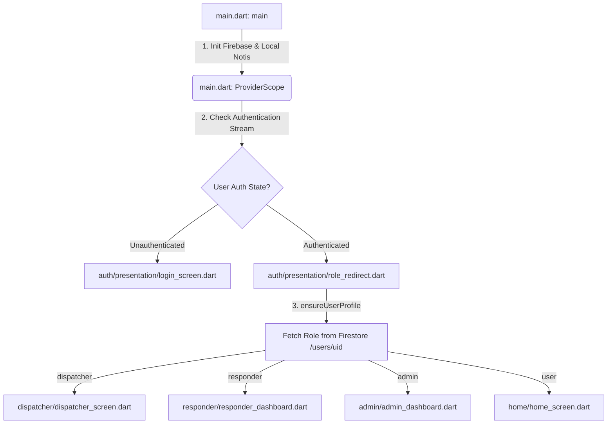

# SUT Campus Incident System — Workspace Lean Guide

This document is a conceptual guide to separate the **core production application** from developmental artifacts, backups, experimental directories, and platform configurations in this repository.

> [!NOTE]  
> This analysis is designed to help university advisors, auditors, and new developers focus strictly on the production business logic of the SUT Campus Incident System without being distracted by extraneous files.

---

## 1. What is the "REAL" App?

The functional campus incident application consists of a cross-platform mobile and web client built in **Flutter**, connected to a serverless backend powered by **Firebase** (Cloud Firestore, Firebase Auth, Firebase Storage, and Cloud Functions). 

The following directories and files constitute the **REAL app** and are strictly required:

| Core Path / Component | Purpose | Why It is Essential |
| :--- | :--- | :--- |
| **`lib/`** | Core Flutter Source Code | Contains the entire front-end application logic, models, services, clean-architecture features, and responsive UIs. |
| **`pubspec.yaml`** | Flutter Package Manifest | Defines the exact package dependencies, environment version boundaries, assets mapping, and entry parameters. |
| **`functions/`** | Node.js Firebase Cloud Functions | The backend serverless layer containing the identity checkers, password reset tools, and FCM multicast push notification dispatch engines. |
| **`firestore.rules`** | Firestore Security Rules | The database security configuration guarding raw collections (`users`, `incidents`, `direct_messages`, `app_config`) against spoofing and unauthorized CRUD access. |
| **`storage.rules`** | Cloud Storage Security Rules | Defines image file-type verification rules (`image/*`) and gates user upload dimensions to max $10\text{ MB}$. |
| **`assets/`** | Graphic & Sound Assets | Houses local sound bites (`sounds/alert.mp3`) and logos (`images/university_logo.png`) critical for system notifications. |

---

## 2. Non-Essential / Distraction Files

Throughout the developmental lifecycle, secondary and metadata files accumulate in the workspace. Below is a classification of files that can be **safely ignored** during evaluation.

### A. Safe to Ignore (Developmental & Editor Metadata)
*   **`.metadata`**: Generated by Flutter to track project properties and branch channels.
*   **`mobile_user_app.iml` / `sut_campus_incident_system.iml`**: JetBrains / IntelliJ IDEA IDE configuration files.
*   **`.flutter-plugins-dependencies`**: Autogenerated platform file listing compiled plugin dependencies.
*   **`.gitignore`**: Excludes operational caches, dependencies, and environment keys from Git.

### B. Legacy, Backups, and Folder Clutter
*   **`cors.json`**: Optional Google Cloud Storage CORS configuration for web upload testing.
*   **`test/widget_test.dart`**: Default autogenerated Flutter widget test stub. Can be bypassed during architectural audits.
*   **`android/` / `ios/` / `web/`**: While these are default build directories containing build manifests (Gradle, XMLs, web assets), they do not contain core application logic. They are build wrappers for platform output.

```
📁 Root Workspace
├── 📁 .git/                         -> Safe to Ignore (Git VCS logs)
├── 📁 .dart_tool/                   -> Generated (Dart analysis caching)
├── 📁 .idea/                        -> Safe to Ignore (IntelliJ configuration metadata)
├── 📁 build/                        -> Generated (Build outputs & caches)
├── 📁 test/                         -> Safe to Ignore (Default stub widget tests)
├── 📄 pubspec.lock                  -> Generated (Pin-pointed concrete dependencies)
└── 📄 *.iml                         -> Safe to Ignore (IDE metadata modules)
```

---

## 3. Minimized Lean Workspace Layout

To facilitate review for university advisors and auditors, here is a proposed minimized structure showing only files that implement actual logic and university features:

```
SUT-Campus-Incident-System/
├── 📁 assets/                          # Static Assets
│   ├── 📁 images/                      # SUT Logos and Branding
│   └── 📁 sounds/                      # Alert Sounds (alert.mp3)
│
├── 📁 functions/                       # Serverless Backend Node.js
│   ├── 📄 index.js                     # Singapore-deployed Cloud Functions
│   └── 📄 package.json                 # Backend Node.js Dependencies
│
├── 📁 lib/                             # Core Flutter Client Application
│   ├── 📄 main.dart                    # Bootstrap & Multi-platform Auth Gate
│   │
│   ├── 📁 core/                        # Shared Infrastructure & Foundations
│   │   ├── 📄 adaptive_map_widget.dart # Cross-platform leaflet / google map adapter
│   │   ├── 📄 providers.dart           # Global Riverpod Catalog
│   │   ├── 📄 theme.dart               # Orange SUT Theming Constants
│   │   └── 📄 web_notification.dart    # Web Notification Platform Selector
│   │
│   ├── 📁 models/                      # Unified Data Contract Mappings
│   │   ├── 📄 incident_model.dart      # Incidents & Milestones Mapping
│   │   └── 📄 user_model.dart          # User & Responder Profiles Mapping
│   │
│   └── 📁 features/                    # Feature-First Architecture Modules
│       ├── 📁 auth/                    # Registration & virtual email authentication
│       ├── 📁 chat/                    # Real-time incident chats & DMs
│       ├── 📁 dispatcher/              # Control center dashboard & responder panel
│       ├── 📁 home/                    # User incident submission console
│       ├── 📁 incident/                # F5 Auto-scoring & F6 Responder tracking
│       ├── 📁 notification/            # FCM notifications & Web listeners
│       └── 📁 profile/                 # User personal details manager
│
├── 📄 firestore.rules                  # Firestore Database Guards
└── 📄 storage.rules                    # Firebase Storage Guards
```

---

## 4. Execution Flow & Architecture

Below is a breakdown of how the client and server communicate when launching and running.

### A. App Startup & Routing Pipeline


### B. State Management System
*   **Riverpod Framework**: Global states are driven by streams hooked into Firebase.
*   **Live Authentication**: `authStateProvider` streams FirebaseAuth `User?`.
*   **Live User Context**: `currentUserProvider` streams user details from Firestore `/users/{uid}`, allowing the application UI (e.g. navigation bar, profile page) to rebuild instantly whenever profile parameters or tracking coordinates change.

### C. Incident Submission & Notification Flow
1.  **Submission**: User submits incident at `lib/features/home/home_screen.dart` via `submitIncident()` on `IncidentRepository`.
2.  **Alert Dispatch**: `IncidentRepository` triggers an HTTPS Callable function `sendPushNotification` for FCM.
3.  **FCM Routing**: FCM routes push payloads (`urgent_incidents_v2` for new cases, `chat_messages` for chats).
4.  **Real-time Listening**:
    *   **Native Client**: Handles FCM payloads via `flutter_local_notifications` and plays native alerts.
    *   **Web Client**: Listens to snapshots using `WebNotificationWatcher` directly from Firestore, triggering browser notifications, Web Audio API chime sounds, and displaying custom overlays that automatically dismiss after 6 seconds.
